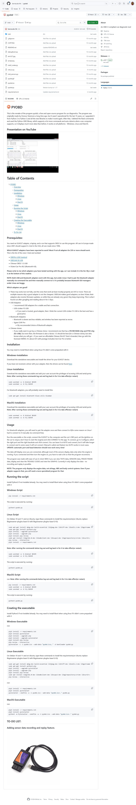

# PYOBD - Python OBD - car diagnostics

This is the remake of the program pyobd, a free and open-source program for car diagnostics. The program was originally made by Donour Sizemore a long time ago, but it wasn't operational for the last 15 years, so I upgraded it from Python 2 to Python 3 and all the new libraries to make it work again. After that, I deleted the fixed commands and used the Python-OBD library, which supports a lot more commands and auto-detects what a cars computer supports, so it displays much more data than before.

<https://github.com/barracuda-fsh/pyobd>
