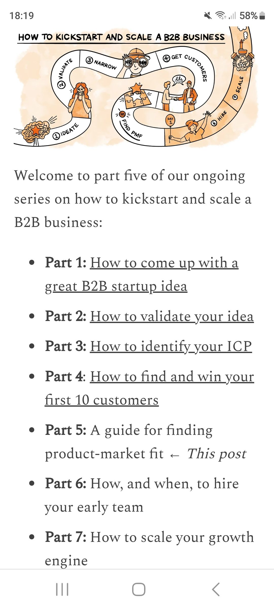

# How the most successful B2B startups came up with their original idea

<https://www.lennysnewsletter.com/p/finding-product-market-fit>

Welcome to part three of our series on how to kickstart and scale a B2B business:

Part 1: How to come up with a great B2B startup idea

Part 2: How to validate your idea

Part 3: How to identify your ICP 

Part 4: How to find and win your first 10 customers

Part 5: How to find product-market fit

Part 6: How, and when, to hire your early team

Part 7: How to scale your growth engine
