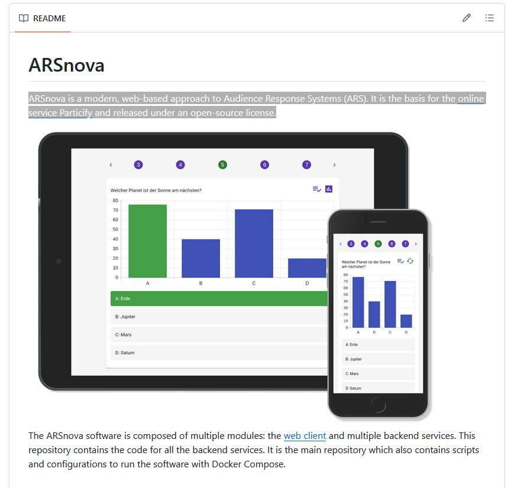

# ARSnova

ARSnova is a modern, web-based approach to Audience Response Systems (ARS). It is the basis for the [online service Particify](https://particify.de) and released under an open-source license.

<https://github.com/particify/arsnova-server>
