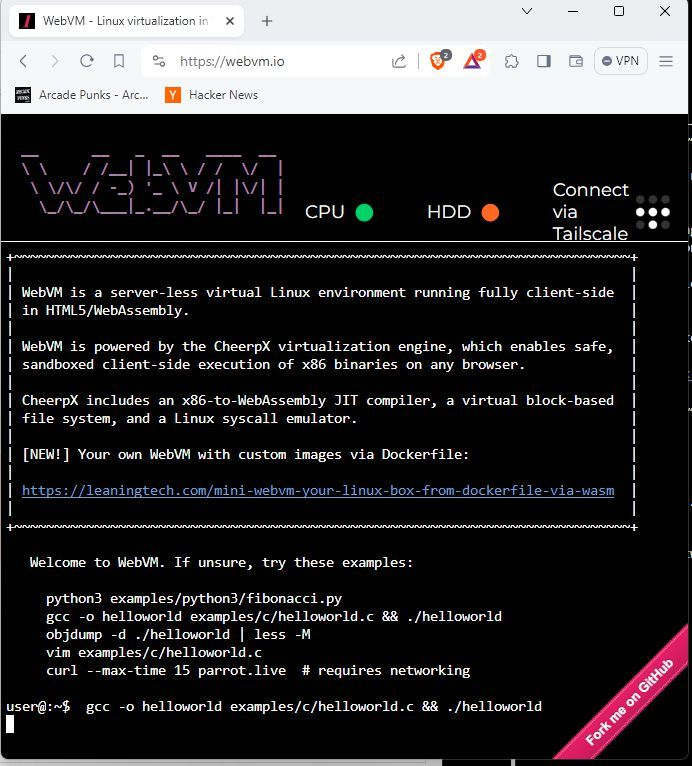

# WebVM

_TLDR: WebVM is a Linux-like virtual machine running fully client-side in the browser. It is based on CheerpX: a x86 execution engine in WebAssembly by Leaning Technologies. With today’s update, you can deploy your own version of WebVM by simply_ [_forking the repo_](https://github.com/leaningtech/webvm) _on GitHub and editing the included Dockerfile. A GitHub Actions workflow will automatically deploy it to GitHub pages._

<https://webvm.io/>

<https://github.com/leaningtech/webvm/>
