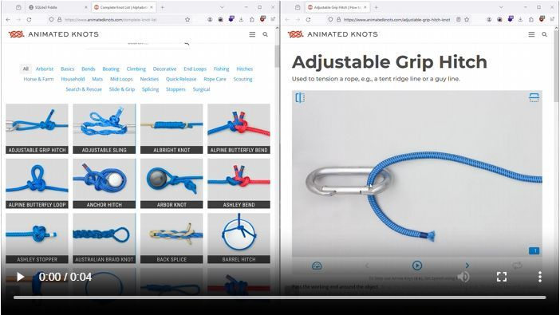

<figure class="video_container">
  <video width="100%"  controls="true" allowfullscreen="true" autoplay poster="../_asset/2023-09-18-Knots_image_1.jpg">
    <source src="../_asset/2023-09-18-Knots_video_1.mp4" type="video/mp4">
  </video>
</figure>

# (echte) Koten 

Animated Knots by Grog is the web’s premiere site for learning how to tie knots of any kind. From [Boating Knots](https://www.animatedknots.com/boating-knots), [Fishing Knots](https://www.animatedknots.com/fishing-knots) and [Climbing Knots](https://www.animatedknots.com/climbing-knots) to [tying a tie](https://www.animatedknots.com/necktie-knots), or even [Surgical Knots](https://www.animatedknots.com/surgical-knots) — we’ve got it covered.

## Links

<https://www.animatedknots.com/>

