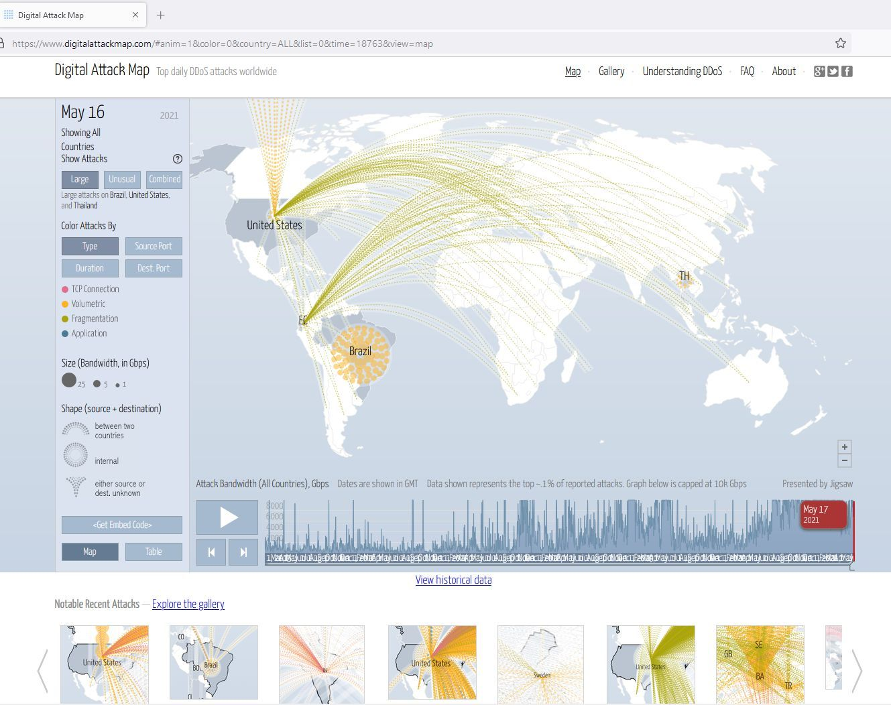

<https://www.digitalattackmap.com/>

# Digitalattackmap

Digital Attack Map is a live data visualization of DDoS attacks around the globe, built through a collaboration between [Google Ideas](http://www.google.com/ideas/) and [Arbor Networks](https://www.arbornetworks.com/). The tool surfaces anonymous attack traffic data to let users explore historic trends and find reports of outages happening on a given day.