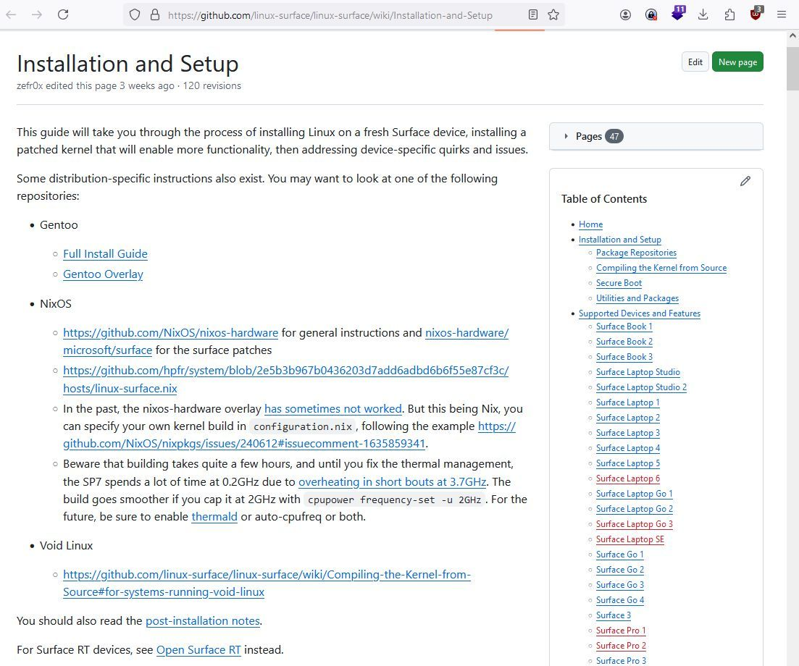

# Linux on Surface - Installation and Setup

This guide will take you through the process of installing Linux on a fresh Surface device, installing a patched kernel that will enable more functionality, then addressing device-specific quirks and issues.

<https://github.com/linux-surface/linux-surface/wiki/Installation-and-Setup>
