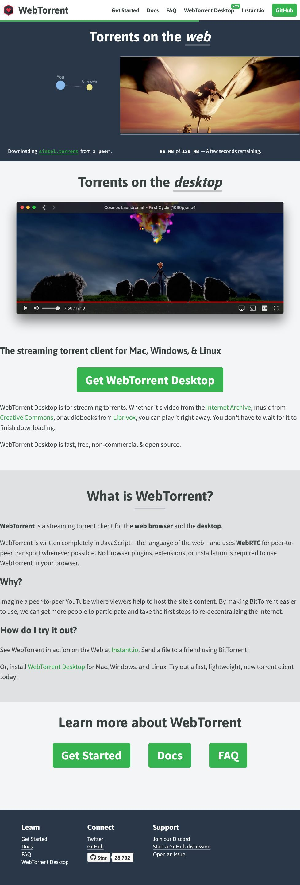

# WebTorrent

WebTorrent is a streaming torrent client for the web browser and the desktop
WebTorrent is written completely in JavaScript – the language of the web – and uses WebRTC for peer-to-peer transport whenever possible. No browser plugins, extensions, or installation is required to use WebTorrent in your browser.
Why?

Imagine a peer-to-peer YouTube where viewers help to host the site's content. By making BitTorrent easier to use, we can get more people to participate and take the first steps to re-decentralizing the Internet.
How do I try it out?

See WebTorrent in action on the Web at Instant.io. Send a file to a friend using BitTorrent!

<https://webtorrent.io/>

<https://instant.io/>
