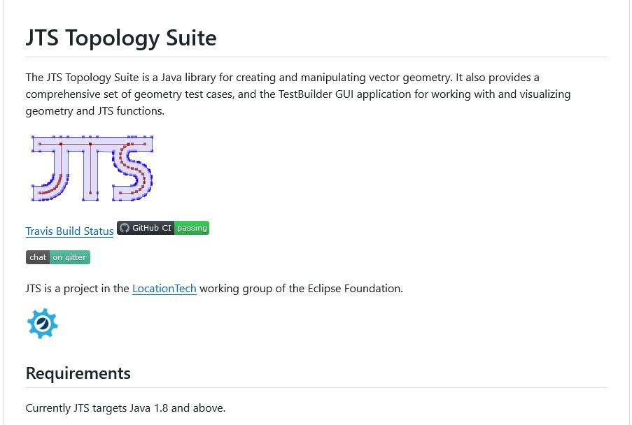

# Geo - Tools
## TG 

TG is a geometry library for C that is small, fast, and easy to use. I designed it for programs that need real-time geospatial, such as geofencing, monitoring, and streaming analysis.

<https://github.com/tidwall/tg>

##  GEOS

GEOS is a C/C++ library for [computational geometry](https://en.wikipedia.org/wiki/Computational_geometry) with a focus on algorithms used in [geographic information systems](https://en.wikipedia.org/wiki/Geographic_information_system) (GIS) software. It implements the [OGC](https://www.ogc.org/standards/sfa) [_Simple Features_](https://en.wikipedia.org/wiki/Simple_Features) geometry model and provides all the spatial functions in that standard as well as many others. GEOS is a core dependency of [PostGIS](https://postgis.net), [QGIS](https://qgis.org), [GDAL](https://gdal.org), [Shapely](https://shapely.readthedocs.io/en/stable/project.html) and [many others](https://libgeos.org/usage/bindings/).

## JTS Topology Suite

The JTS Topology Suite is a Java library for creating and manipulating vector geometry.

<https://libgeos.org/>

<https://github.com/locationtech/jts/>
## # Maps with Django: GeoDjango, PostGIS & Leaflet
A quickstart guide to create a web map with the Python-based web framework Django using its module GeoDjango, the PostgreSQL database with its spatial extension PostGIS and Leaflet, a JavaScript library for interactive maps.

<https://www.paulox.net/2021/07/19/maps-with-django-part-2-geodjango-postgis-and-leaflet/>
## Leaflet.Editable
Make geometries editable in Leaflet.

This is not a plug and play UI, and will not be. This is a minimal, lightweight, and fully extendable API to control editing of geometries. So you can easily build your own UI with your own needs and choices.

<https://github.com/Leaflet/Leaflet.Editable>

## Folium
Folium Python data, leaflet.js maps

<https://python-visualization.github.io/folium/latest/getting_started.html>

## ipyleaflet

A Jupyter - Leaflet.js bridge

<https://github.com/jupyter-widgets/ipyleaflet>

## Leaflet 

an open-source JavaScript library  
for mobile-friendly interactive maps

Leaflet is the leading open-source JavaScript library for mobile-friendly interactive maps. Weighing just about 42 KB of JS, it has all the mapping [features](https://leafletjs.com/index.html#features) most developers ever need.

Leaflet is designed with _simplicity_, _performance_ and _usability_ in mind. It works efficiently across all major desktop and mobile platforms, can be extended with lots of [plugins](https://leafletjs.com/plugins.html), has a beautiful, easy to use and [well-documented API](https://leafletjs.com/reference.html "Leaflet API reference") and a simple, readable [source code](https://github.com/Leaflet/Leaflet "Leaflet source code repository on GitHub") that is a joy to [contribute](https://github.com/Leaflet/Leaflet/blob/main/CONTRIBUTING.md "A guide to contributing to Leaflet") to.

<https://lycheelin.github.io/leaflet.migrationLayer/>
