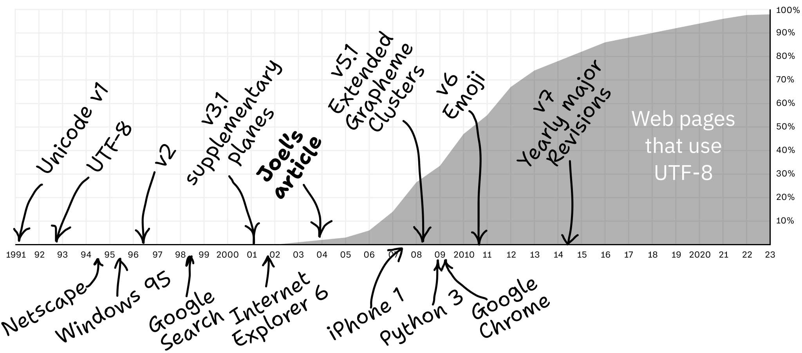
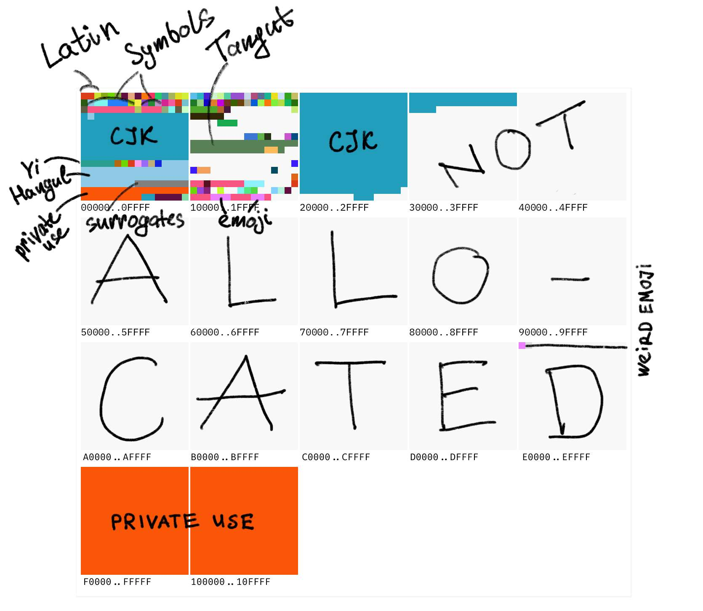

# The Absolute Minimum Every Software Developer Must Know About Unicode in 2023 (Still No Excuses!)

his is how it works:

|Code point|Byte 1|Byte 2|Byte 3|Byte 4|
|---|---|---|---|---|
|U+`0000`..`007F`|`0xxxxxxx`|
|U+`0080`..`07FF`|`110xxxxx`|`10xxxxxx`|
|U+`0800`..`FFFF`|`1110xxxx`|`10xxxxxx`|`10xxxxxx`|
|U+`10000`..`10FFFF`|`11110xxx`|`10xxxxxx`|`10xxxxxx`|`10xxxxxx`|

## Link
<https://tonsky.me/blog/unicode/>
