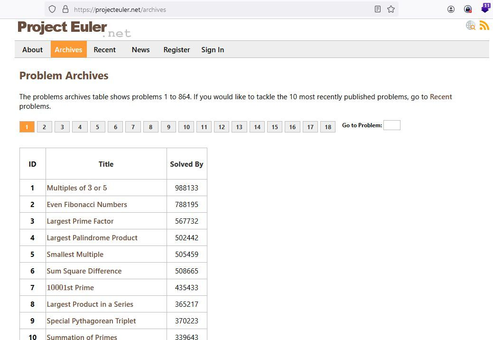

# # Project Euler

# Project Euler
## What is Project Euler?

Project Euler is a series of challenging mathematical/computer programming problems that will require more than just mathematical insights to solve. Although mathematics will help you arrive at elegant and efficient methods, the use of a computer and programming skills will be required to solve most problems.  
  
The motivation for starting Project Euler, and its continuation, is to provide a platform for the inquiring mind to delve into unfamiliar areas and learn new concepts in a fun and recreational context.

<https://projecteuler.net/about>
