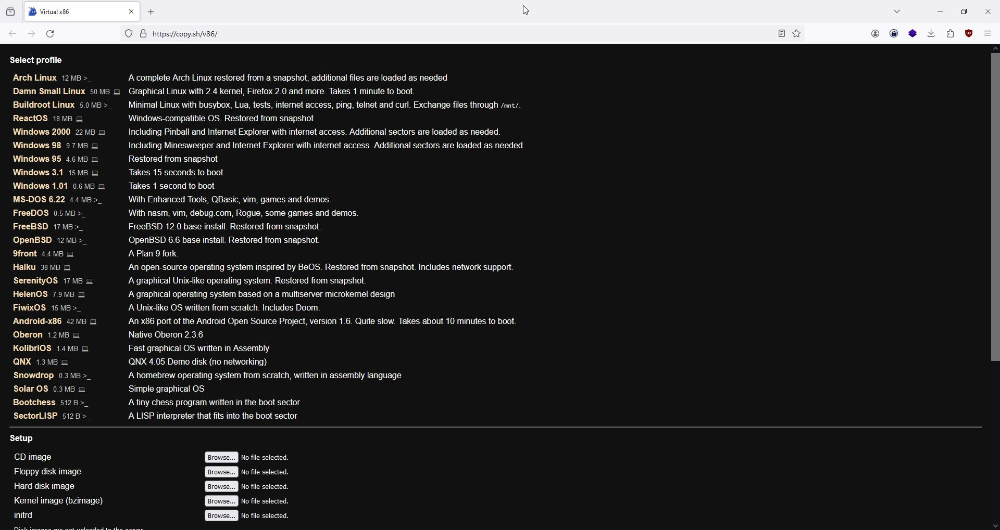
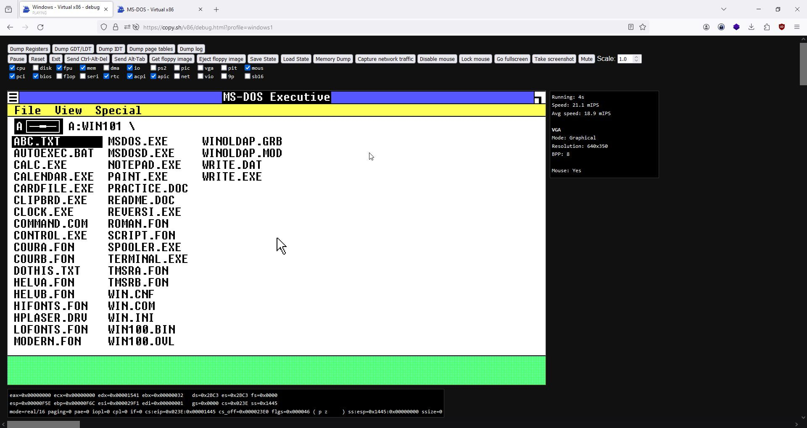
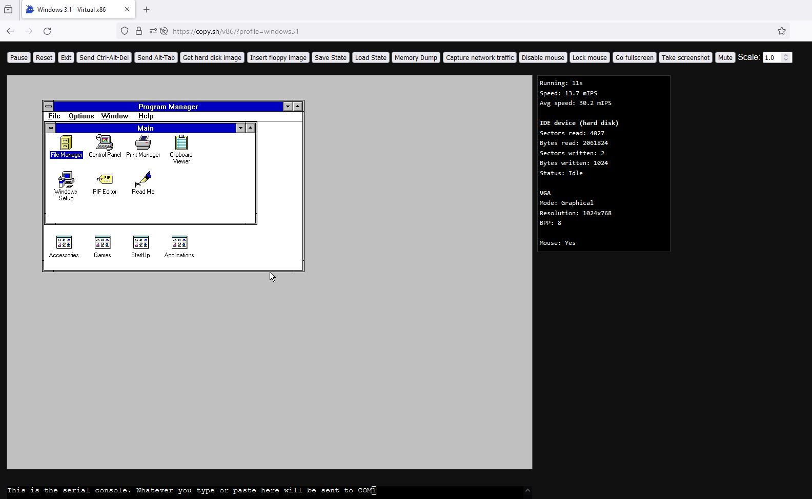
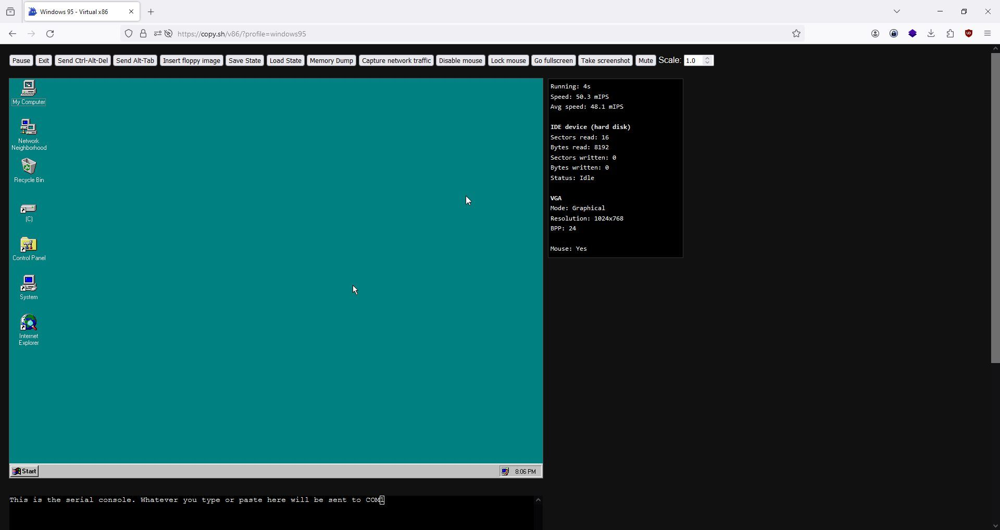
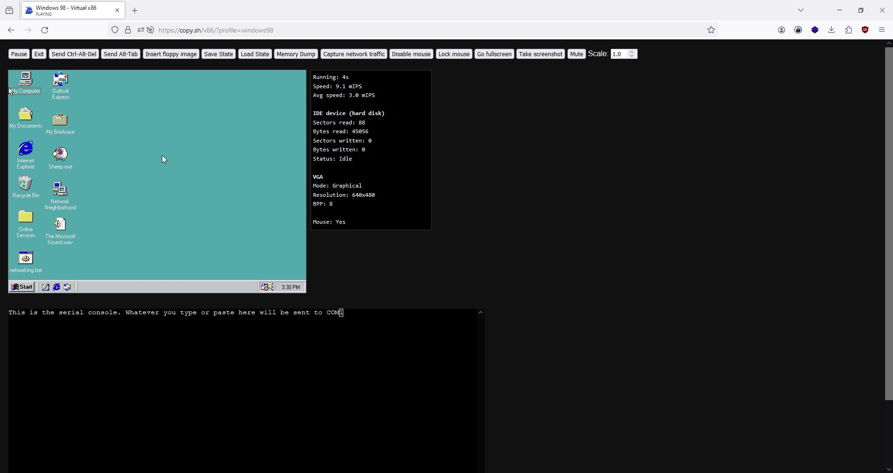
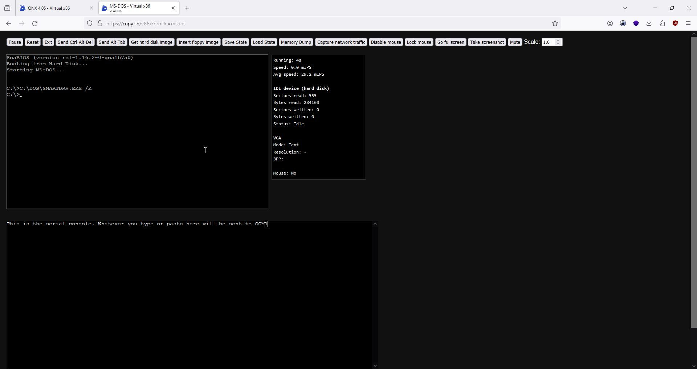
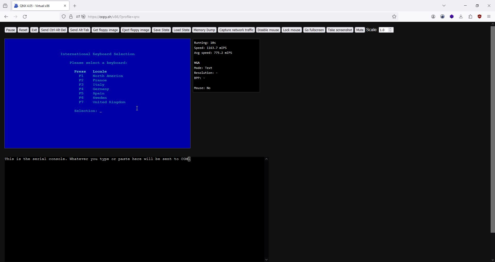
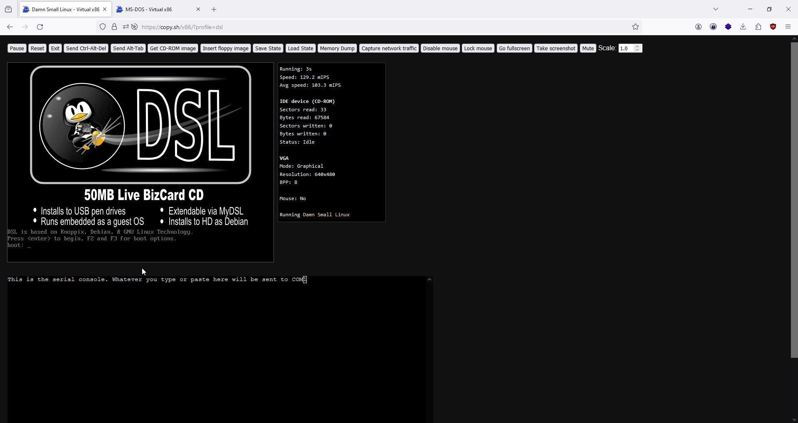
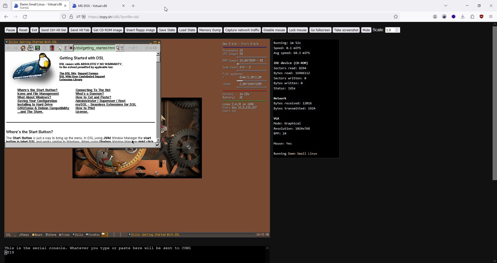
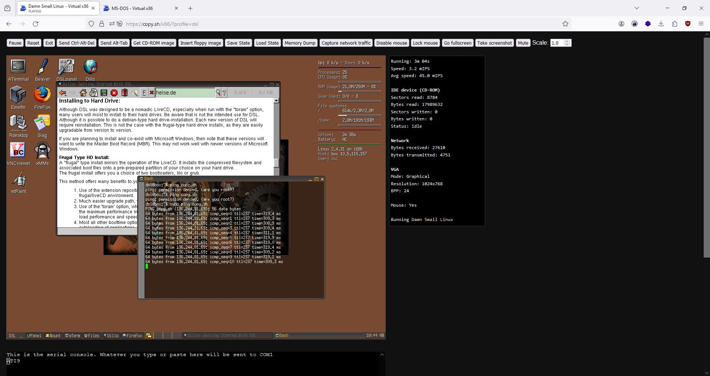

# Wasm Systems - Operating Systems 

<https://copy.sh/v86/advent/2023/>
<https://copy.sh/v86/>
<https://github.com/copy/v86>
<http://qemu-advent-calendar.org/2023/> 

## Win 101

## windows 31

## windows 95 

## windows 98 

## msdos 6.22

## QNX

## DSL 

