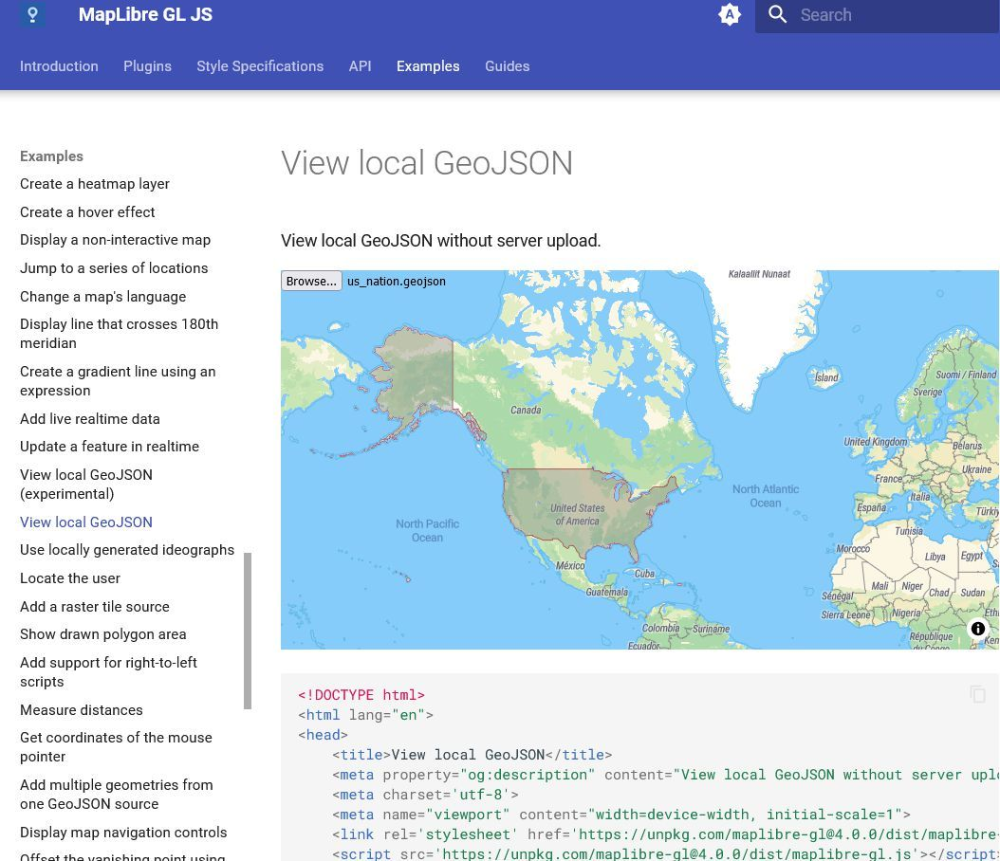

# Map vector Maptiler 

 
<https://data.maptiler.com/downloads/europe/germany/dortmund/>

<https://github.com/maplibre/awesome-maplibre>

## MapLibre GL JS

<https://maplibre.org/maplibre-gl-js/docs/examples/>

<https://www.axismaps.com/guide/resources>

<https://www.webgis.dev/posts/loading-and-optimizing-wfs-layers>

<https://basemap.de/web-vektor/>

<https://gis.stackexchange.com/questions/245071/appropriate-web-server-framework-for-serving-slices-of-an-interactive-leaflet-ve>

Set up your own vector tile server to use with QGIS with Tim Sutton

<https://m.youtube.com/watch?v=KAJSvKGzAak>

<https://access.crunchydata.com/documentation/pg_tileserv/1.0.3/examples/>

pg_featureserv

<https://github.com/CrunchyData/pg_featureserv>

<https://zulip.gis.chat/>

<https://www.i-programmer.info/news/145-mapping-a-gis/16772-spatial-data-management-for-gis-and-data-scientists.html>
