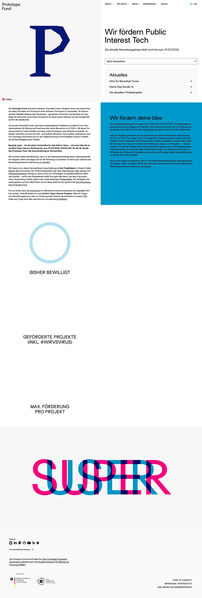

# Prototype Fund

<https://prototypefund.de/bewerbung/faq/>

Der Prototype Fund ist das erste niedrigschwellige Förderprogramm für freie Entwickler*innen, die in Deutschland innovative Open-Source-Software aus der Gesellschaft und für die Gesellschaft entwickeln.

Auch den Prototype Fund selbst verstehen wir als Prototypen. Unser Programm ist das erste öffentliche Förderprogramm eines Bundesministeriums, das sich gezielt an Open-Source-Entwickler*innen in Selbstständigkeit oder Freiberufliche richtet. Wir wollen lernen, unsere Erfahrungen teilen und euch dabei unterstützen, eure Projekte und Vorhaben bestmöglich zu stemmen. Hier findet ihr die wichtigsten Informationen zur Bewerbung.
