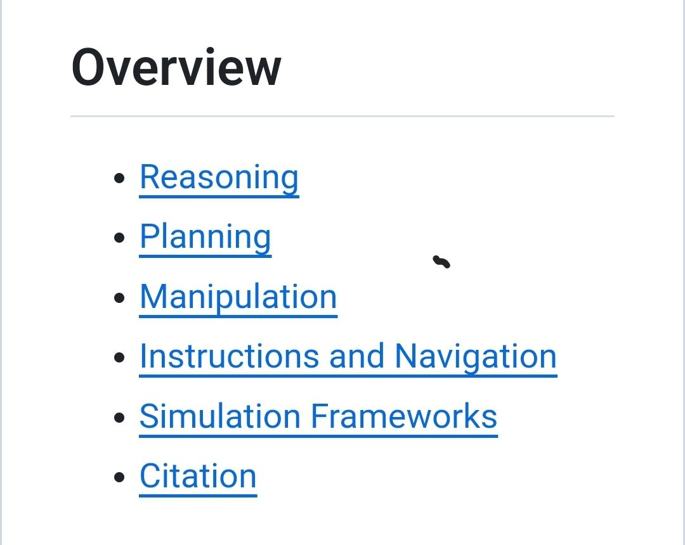

# comprehensive list of llm Papers 2022+
<https://github.com/GT-RIPL/Awesome-LLM-Robotics#simulation-frameworks>

A comprehensive list of papers using large language/multi-modal models for Robotics/RL, including papers, codes, and related websites

