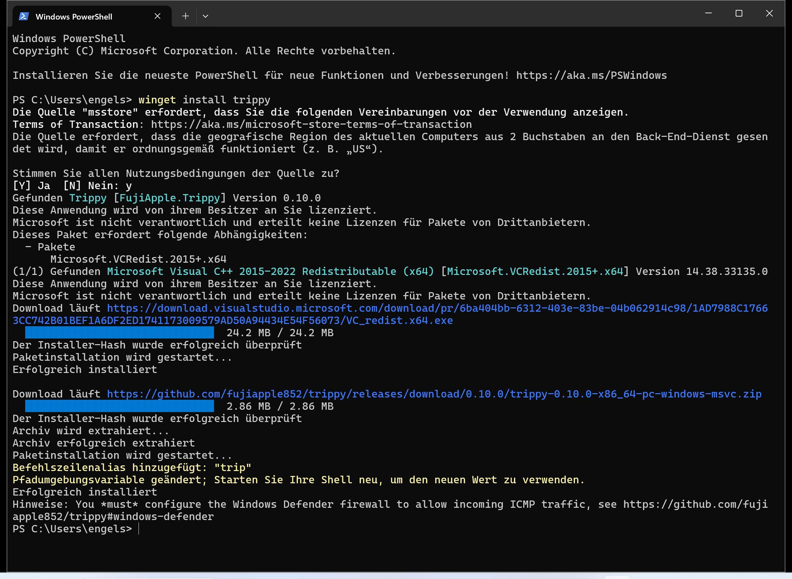
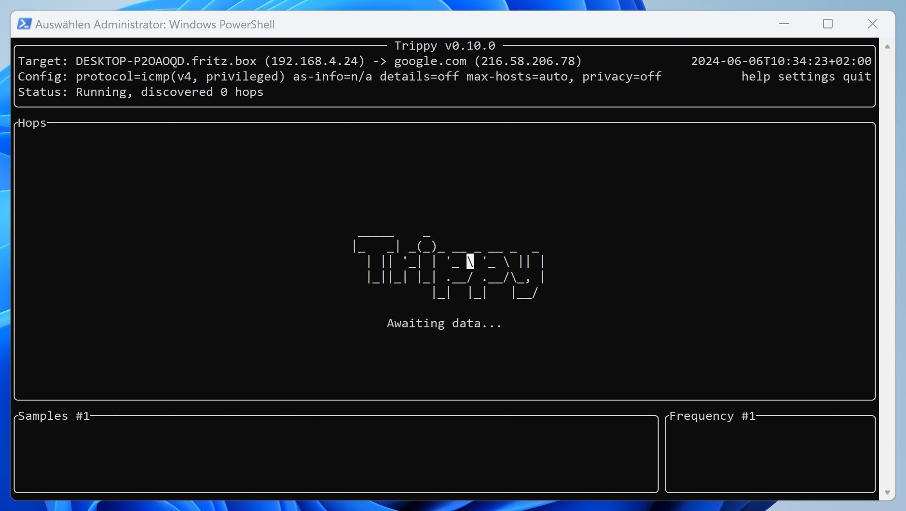
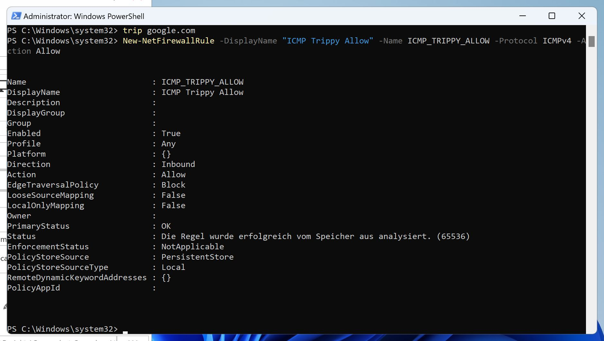
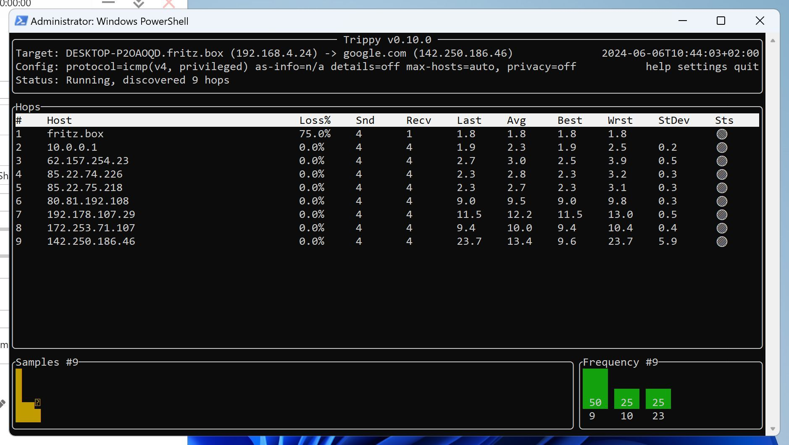

# Trippy ping + TRacroute for Windows Console 

<https://trippy.cli.rs/>

Trippy combines the functionality of traceroute and ping and is designed to assist with the analysis of networking issues.
```BAT
winget install trippy

```


## Beispiel 


### keine Daten ?



```
New-NetFirewallRule -DisplayName "ICMP Trippy Allow" -Name ICMP_TRIPPY_ALLOW -Protocol ICMPv4 -Action Allow
```




