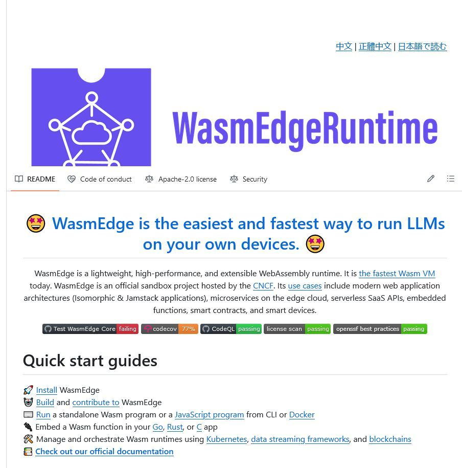

# WasmEdge Runtime  

WasmEdge is a lightweight, high-performance, and extensible WebAssembly runtime. It is [the fastest Wasm VM](https://ieeexplore.ieee.org/document/9214403) today. WasmEdge is an official sandbox project hosted by the [CNCF](https://www.cncf.io/). Its [use cases](https://wasmedge.org/book/en/use_cases.html) include modern web application architectures (Isomorphic & Jamstack applications), microservices on the edge cloud, serverless SaaS APIs, embedded functions, smart contracts, and smart devices.

WasmEdge is a lightweight, high-performance, and extensible WebAssembly runtime for cloud native, edge, and decentralized applications. It powers serverless apps, embedded functions, microservices, smart contracts, and IoT devices.

<https://github.com/WasmEdge/WasmEdge>