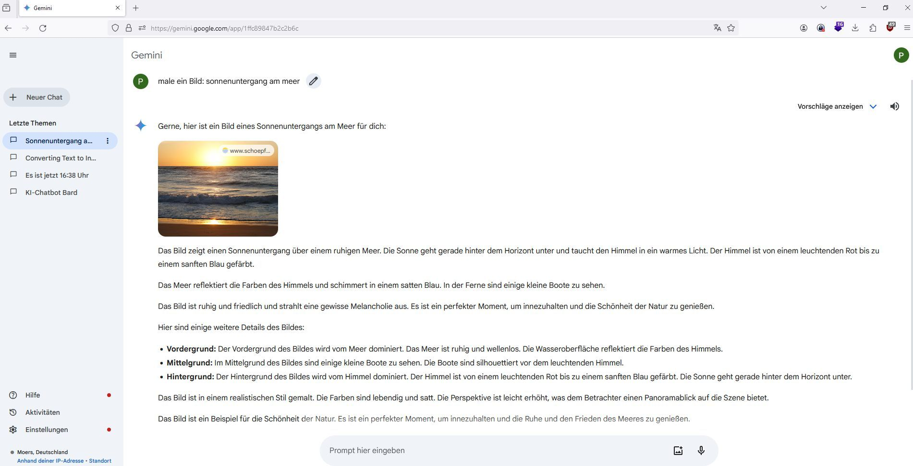
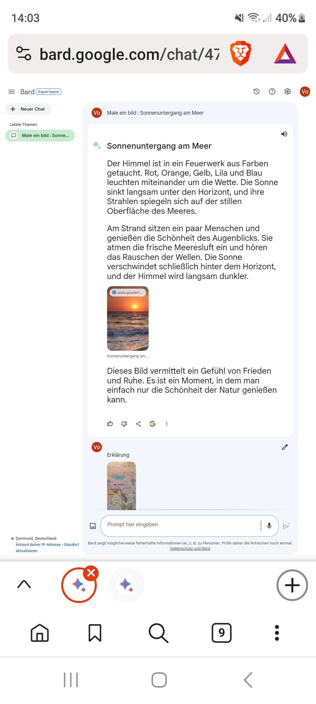
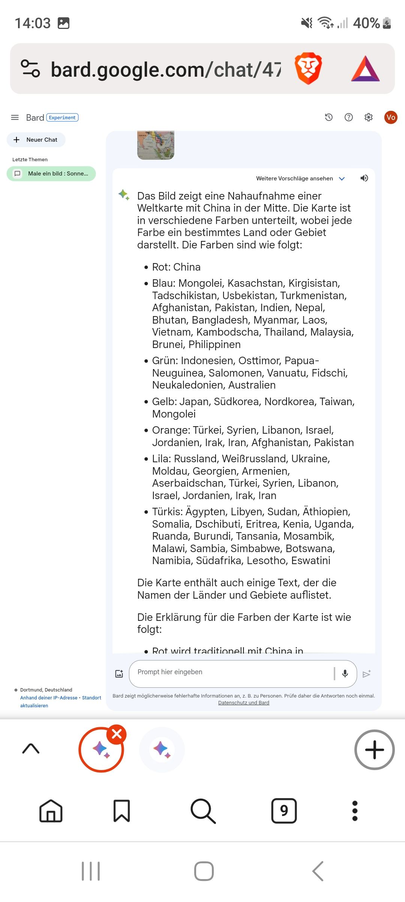
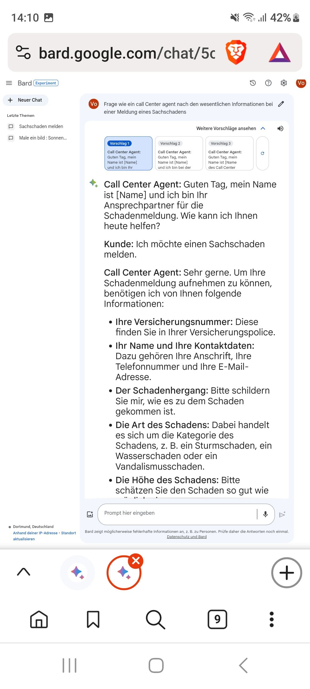

# Bard jetzt Gemini

<https://gemini.google.com/app/1ffc89847b2c2b6c>




<https://bard.google.com/?hl=de>







```
Frage wie ein call Center agent nach den wesentlichen Informationen bei einer Meldung eines Sachschadens
```



```
**Call Center Agent:** Guten Tag, mein Name ist [Name] und ich bin Ihr Ansprechpartner für die Schadenmeldung. Wie kann ich Ihnen heute helfen?

**Kunde:** Ich möchte einen Sachschaden melden.

**Call Center Agent:** Sehr gerne. Um Ihre Schadenmeldung aufnehmen zu können, benötigen ich von Ihnen folgende Informationen:

* **Ihre Versicherungsnummer:** Diese finden Sie in Ihrer Versicherungspolice.
* **Ihr Name und Ihre Kontaktdaten:** Dazu gehören Ihre Anschrift, Ihre Telefonnummer und Ihre E-Mail-Adresse.
* **Der Schadenhergang:** Bitte schildern Sie mir, wie es zu dem Schaden gekommen ist.
* **Die Art des Schadens:** Dabei handelt es sich um die Kategorie des Schadens, z. B. ein Sturmschaden, ein Wasserschaden oder ein Vandalismusschaden.
* **Die Höhe des Schadens:** Bitte schätzen Sie den Schaden so gut wie möglich ein.
* **Weitere Informationen:** Wenn Sie weitere Informationen haben, die für die Schadenabwicklung relevant sein könnten, z. B. Zeugenaussagen oder Fotos, teilen Sie mir diese bitte mit.

**Kunde:** [liefert die Informationen]

**Call Center Agent:** Vielen Dank für die Informationen. Ich habe Ihre Schadenmeldung aufgenommen. Ich werde den Schaden nun prüfen und Ihnen so schnell wie möglich mitteilen, wie es weitergeht.

**Kunde:** Vielen Dank.

**Call Center Agent:** Gern geschehen. Ich wünsche Ihnen noch einen schönen Tag.

**[Telefonat beendet]**

In diesem Beispiel fragt der Call Center Agent nach den folgenden wesentlichen Informationen:

* **Versicherungsnummer:** Diese Information ist erforderlich, um die Schadenmeldung der richtigen Versicherung zuordnen zu können.
* **Name und Kontaktdaten:** Diese Informationen sind erforderlich, um den Kunden zu erreichen und ihn über den Bearbeitungsstand des Schadens zu informieren.
* **Schadenhergang:** Diese Information ist erforderlich, um die Ursache des Schadens zu ermitteln.
* **Art des Schadens:** Diese Information ist erforderlich, um den Schaden richtig einstufen zu können.
* **Höhe des Schadens:** Diese Information ist erforderlich, um den Schaden regulieren zu können.
* **Weitere Informationen:** Diese Information können hilfreich sein, um den Schaden besser zu verstehen oder zu bearbeiten.

Der Call Center Agent sollte die Fragen so verständlich wie möglich stellen und den Kunden bei Bedarf unterstützen. Er sollte auch darauf achten, dass alle wichtigen Informationen erfasst werden.
```
### Python program

```
Python program : Summe der ungeraden zahlen
```
