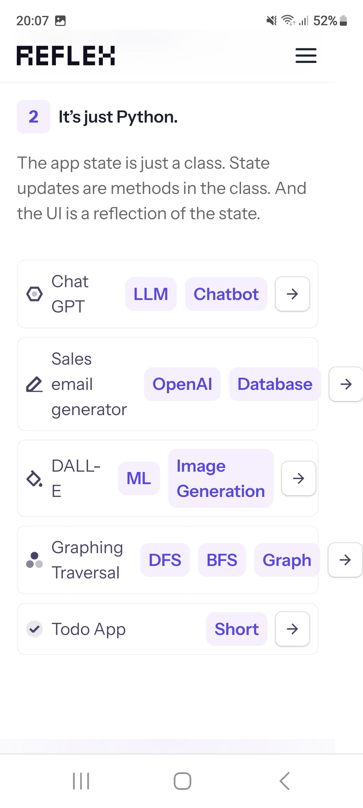

# Web apps in pure Python

Build web apps in minutes. Deploy with a single command. 

Create your whole app in a single language. Don't worry about writing APIs to connect your frontend and backend.

<https://reflex.dev/>

<https://github.com/reflex-dev/reflex>

<https://reflex.dev/docs/library/>

<https://reflex.dev/>

