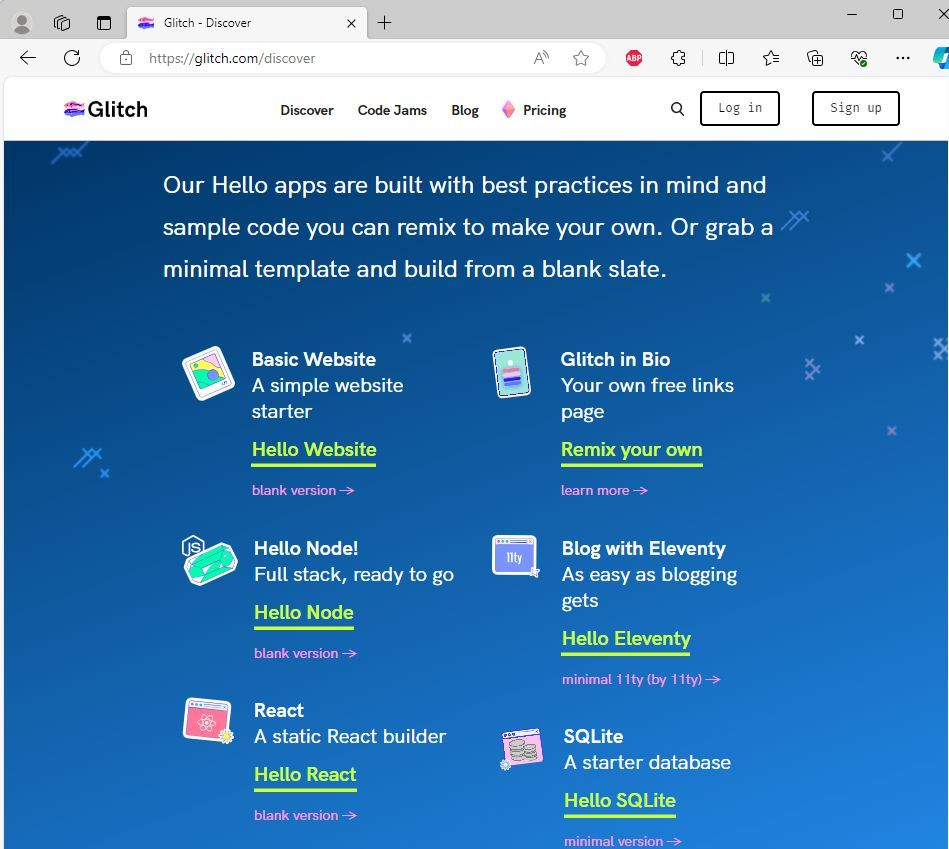

# We make Glitch so it's easier for you to make the web

Glitch is the place where millions of creators, professionals and educators build the open web together. Our job is to give you fast, fun tools for building the website of your dreams.We make it easy to instantly remix projects and put your own spin on them. Just start typing, and Glitch will immediately show your changes in a preview window. Glitch began as an experiment by developers, for developers, to remove the worst friction points of starting something new. The result is the most inclusive and prolific developer community in history, and a showcase for web projects you can’t find anywhere else.

<https://glitch.com/>

Glitch is the friendly place where everyone builds the web. Start a new blog, play with React, or build new worlds with WebXR
