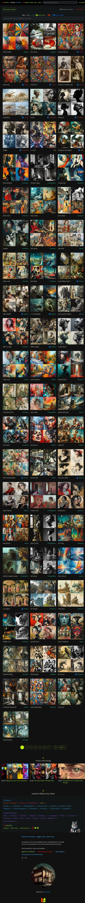
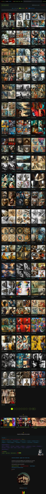

# Midjourney artistic styles

<https://midlibrary.io/styles>

Midlibrary: Library of 4000 Midjourney artistic styles
# dev docs
<https://devdocs.io/javascript/classes>

# curated list of ML oss devops
<https://github.com/EthicalML/awesome-production-machine-learning>

A curated list of awesome open source libraries to deploy, monitor, version and scale your machine learning

# Jason's ML 101 slides

<https://docs.google.com/presentation/d/1kSuQyW5DTnkVaZEjGYCkfOxvzCqGEFzWBy4e9Uedd9k/preview?imm_mid=0f9b7e&cmp=em-data-na-na-newsltr_20171213&pli=1&slide=id.g22aaaf9c33_0_23>