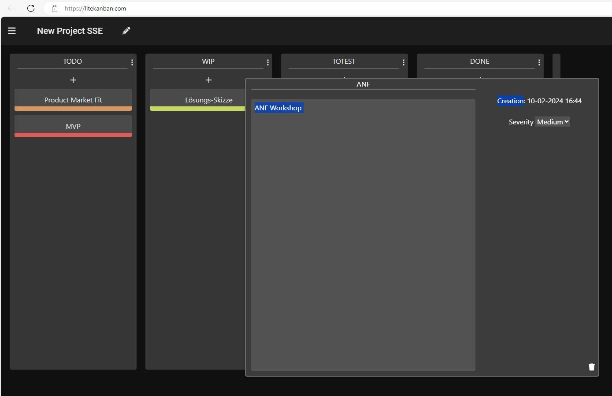

# Kanban Board

<https://github.com/binaryArrow/canban2>

# Kanban board with browser's indexed DB

This is a small Project to organize other small projects without the need to create an account in some Kanban dashboard tool. One can use this directly in the browser, everything is saved in the browser's indexdb, so be careful clearing browser data.

<https://litekanban.com/>
