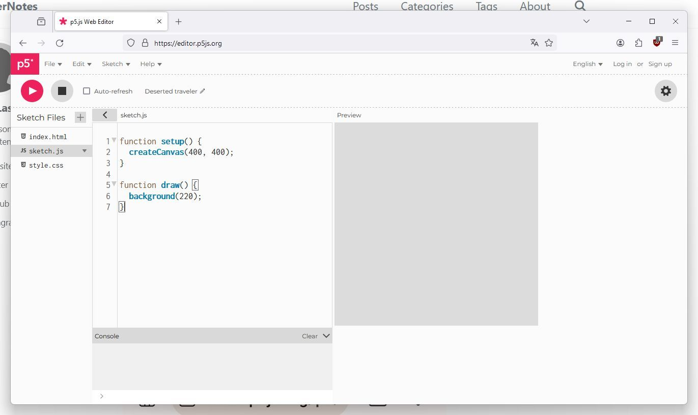
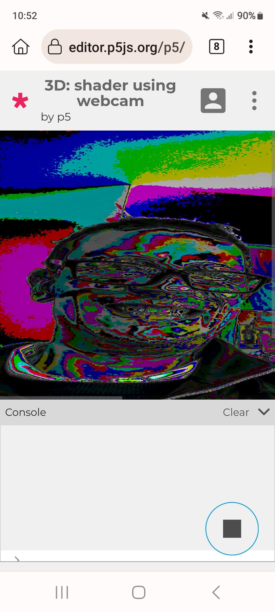

# p5.js - p5.js is a JavaScript library for creative coding

<https://p5js.org/>

p5.js is a JavaScript library for creative coding, with a focus on making coding accessible and inclusive for artists, designers, educators, beginners, and anyone else! p5.js is free and open-source because we believe software, and the tools to learn it, should be accessible to everyone.

Using the metaphor of a sketch, p5.js has a full set of drawing functionality. However, you’re not limited to your drawing canvas. You can think of your whole browser page as your sketch, including HTML5 objects for text, input, video, webcam, and sound.

