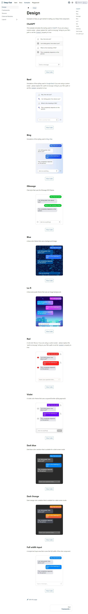

**Deep Chat** is a fully customizable AI chat component that can be injected into your website with minimal to no effort. Whether you want to create a chatbot that leverages popular APIs such as ChatGPT or connect to your own custom service, this component can do it all! Explore [deepchat.dev](https://deepchat.dev/) to view all of the available features, how to use them, examples and more!
<https://deepchat.dev/docs/webModel/>

Run a chat model entirely on your browser. No need to connect to any service.

<https://github.com/OvidijusParsiunas/deep-chat>

<https://deepchat.dev/>

[GitHub - OvidijusParsiunas/deep-chat: Fully customizable AI chatbot component for your website](https://github.com/OvidijusParsiunas/deep-chat)
