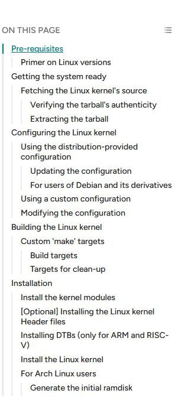

# A Guide to Compiling the Linux Kernel All By Yourself

You may be interested in compiling the Linux kernel yourself, for many reasons. It might be, but not limited to, one of the following:

- Trying out a newer kernel than what your Linux distribution provides
- Building the kernel with a different set of configuration options and/or drivers
- A learner's curiosity :)

This guide will show you how you can compile the Linux kernel yourself, with the commands that you should run, why run these commands and explain what it does. This is a long one, so brace yourself!

<https://itsfoss.com/compile-linux-kernel/>

