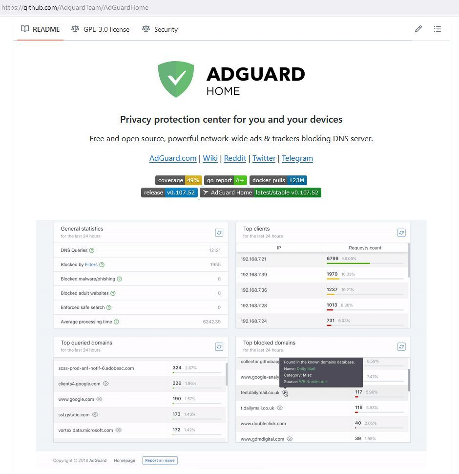
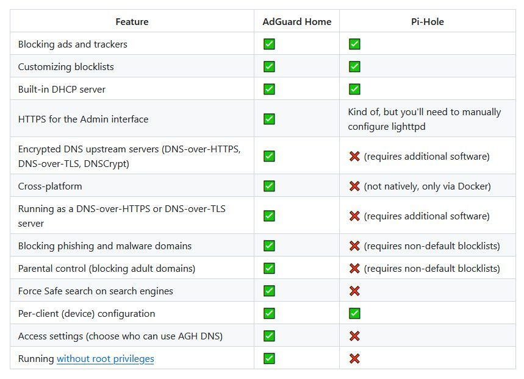

# AdGuard Home
AdGuard Home is a network-wide software for blocking ads and tracking. After you set it up, it'll cover ALL your home devices, and you don't need any client-side software for that.

It operates as a DNS server that re-routes tracking domains to a “black hole”, thus preventing your devices from connecting to those servers. It's based on software we use for our public [AdGuard DNS](https://adguard-dns.io/) servers, and both share a lot of code.

## Links
<https://github.com/AdguardTeam/AdGuardHome>
