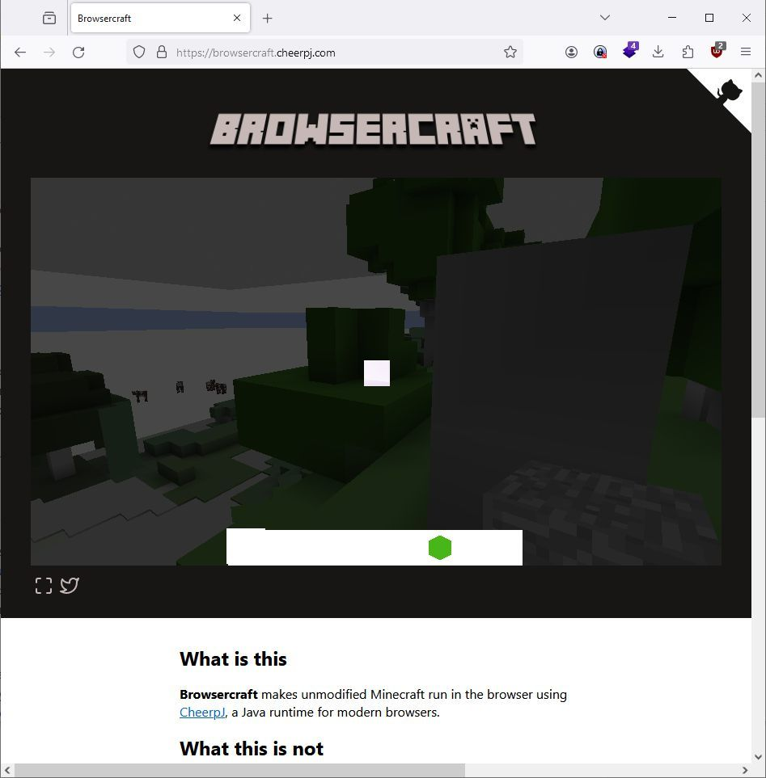
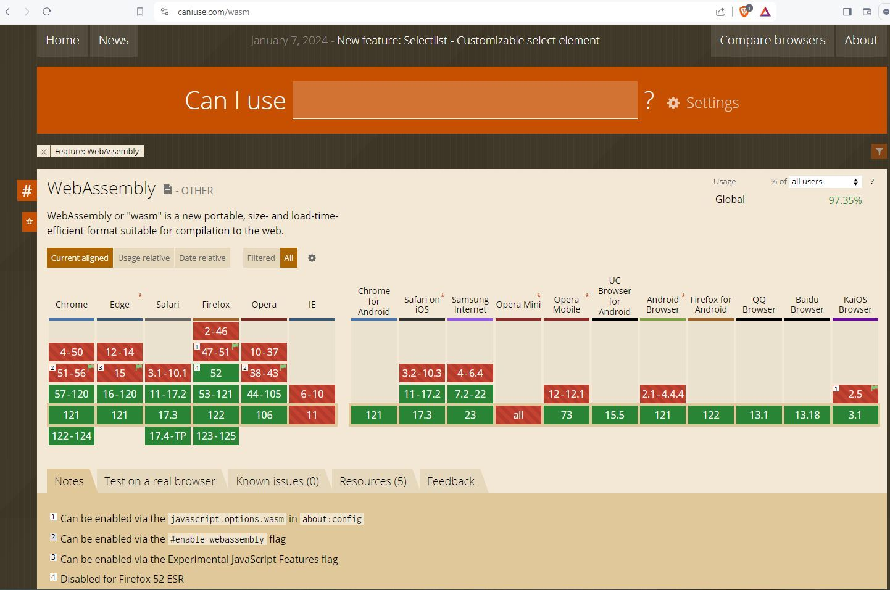

# Browsercraft

This is a proof of concept of Minecraft running unmodified in the browser, using CheerpJ.

See the website for a live demo and more information.

<https://github.com/leaningtech/browsercraft>

<https://browsercraft.cheerpj.com/>

# The complete Java runtime for modern browsers
CheerpJ is the only solution which can run any large-scale, unmodified Java applications, applets, or libraries in the browser. No downloads or plugins required.

<https://cheerpj.com/> 

<https://caniuse.com/wasm>
