#  CryptPad

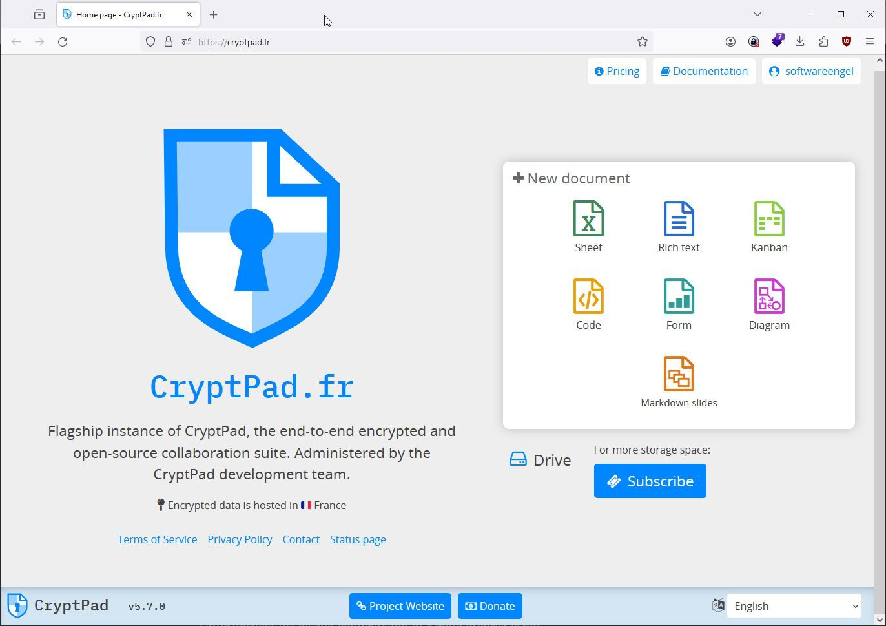

<https://github.com/cryptpad/cryptpad>

<https://cryptpad.fr>

<https://github.com/cryptpad/cryptpad>

CryptPad is a collaboration suite that is end-to-end-encrypted and open-source. It is built to enable collaboration, synchronizing changes to documents in real time. Because all data are encrypted, in the eventuality of a breach, attackers have no way of seeing the stored content. Moreover, if the administrators don’t alter the code, they and the service also cannot infer any piece of information about the users' content.

## settings

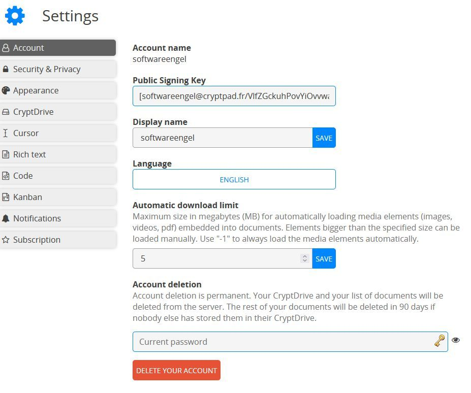

## subscription 

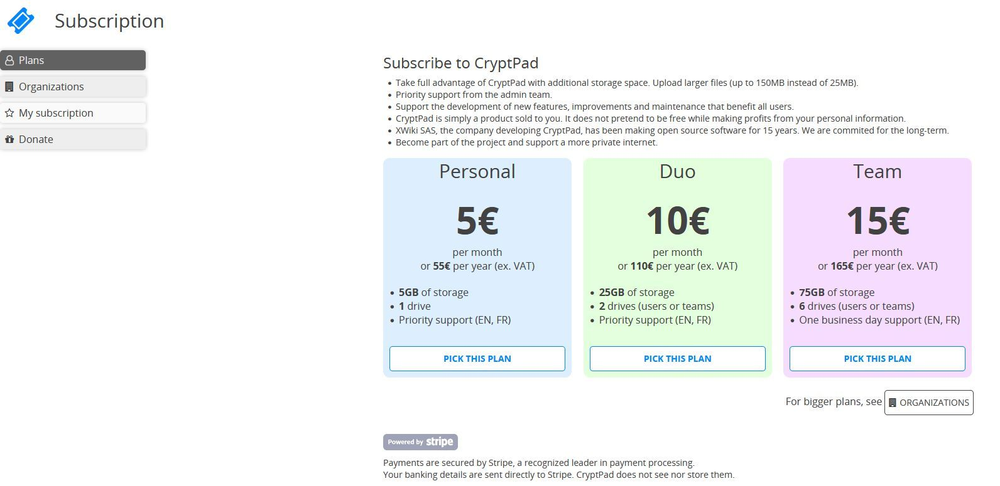

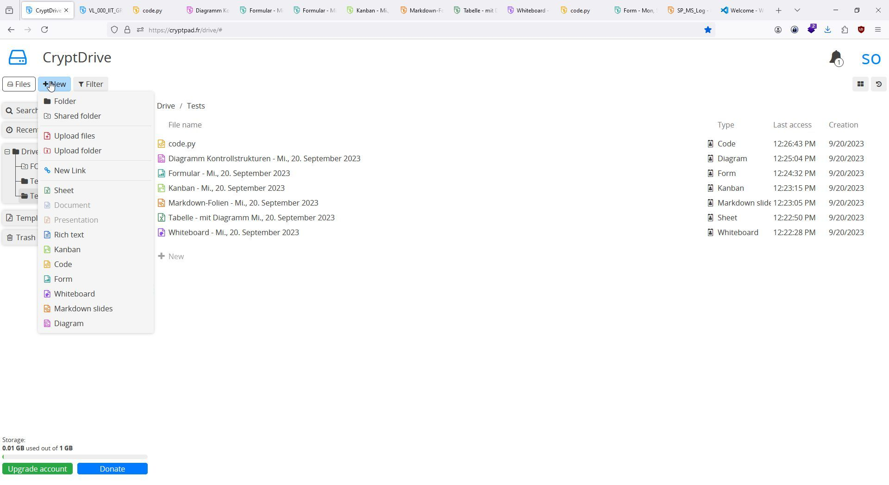

## Kanban - Board 

 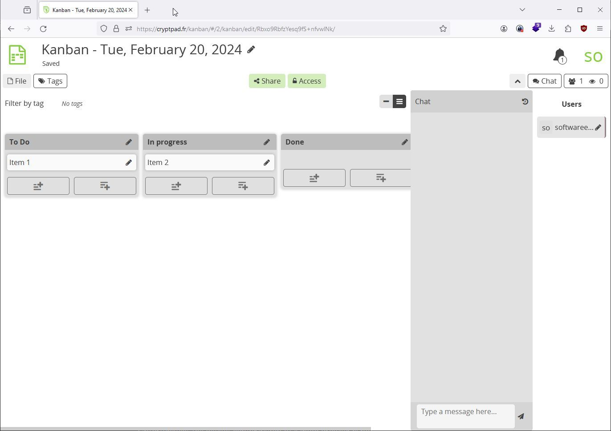
## Overview

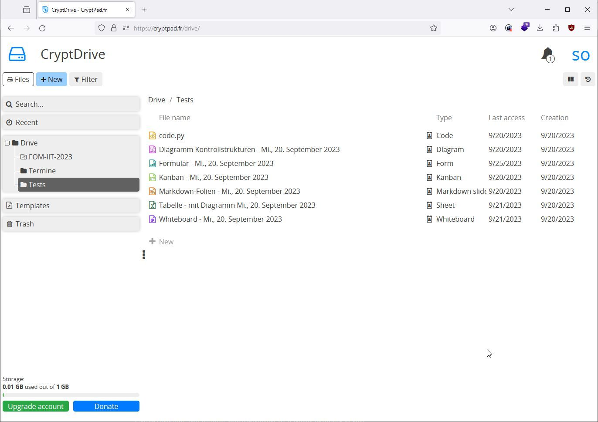

## code markdown

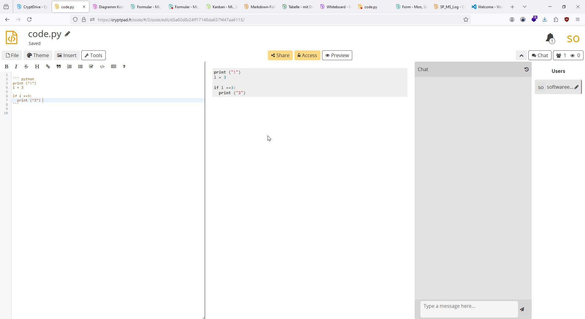

## Diagramm

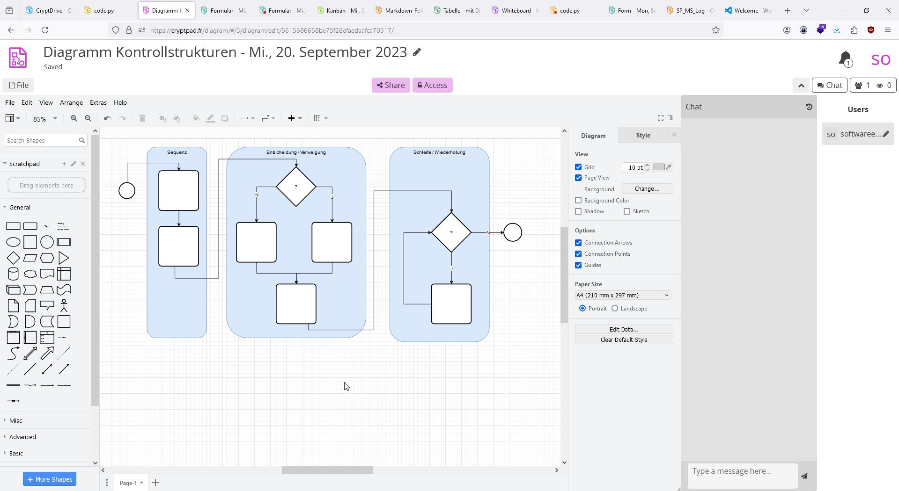

## Formular 

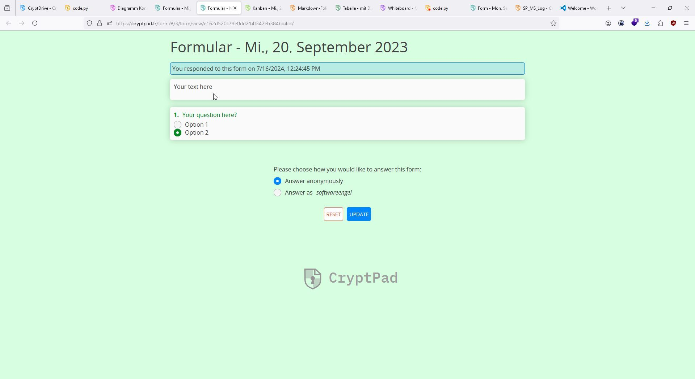
## Form Terminvorschläge 

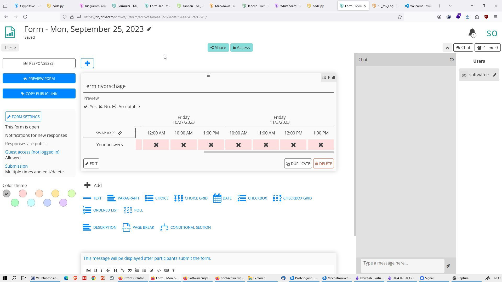

## Kanban Board mit Tags 

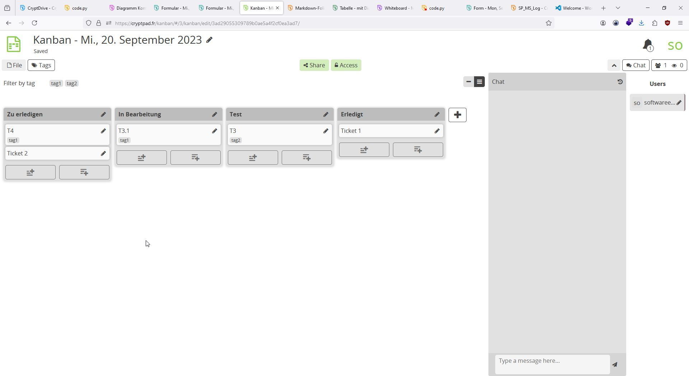

## Markdown Folien 

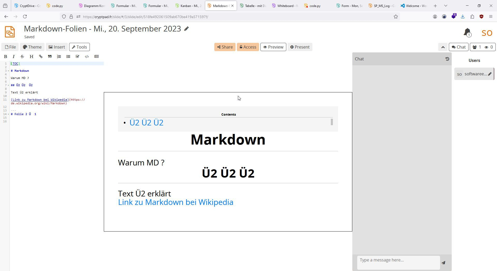

## Tabelle mit Diagramm und Formeln

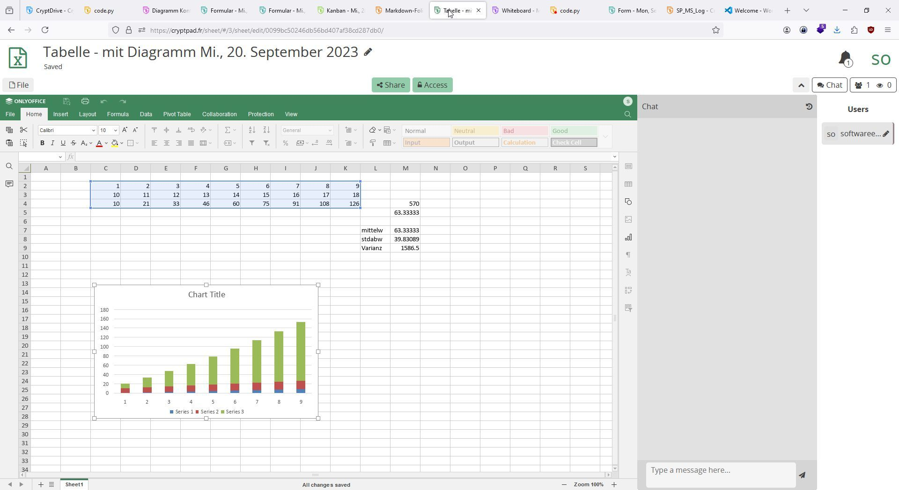

## Whiteboard 

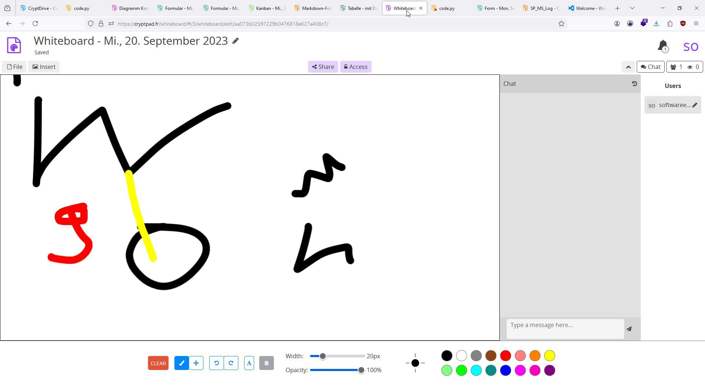

## PDF  - Viewer 

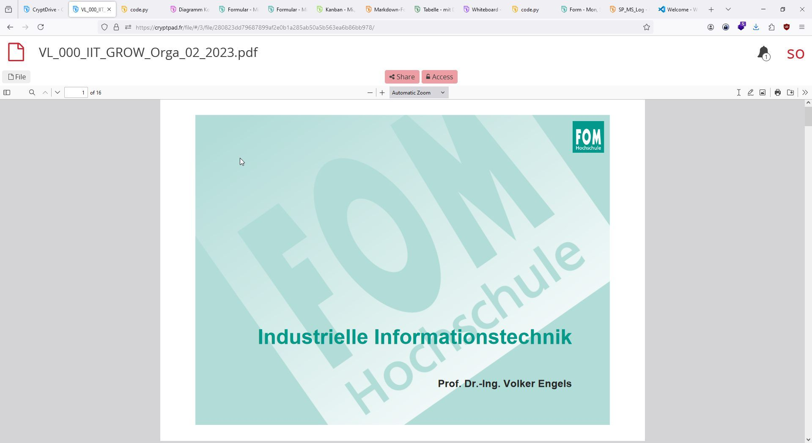

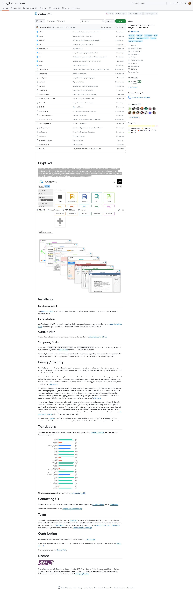