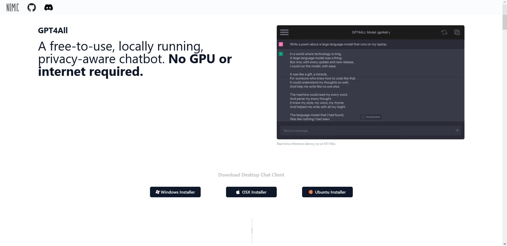

# gpt4all

## How GPT4All Works

GPT4All is an ecosystem to train and deploy **powerful** and **customized** large language models that run **locally** on consumer grade CPUs.

The goal is simple - be the best instruction tuned assistant-style language model that any person or enterprise can freely use, distribute and build on.

A GPT4All model is a 3GB - 8GB file that you can download and plug into the GPT4All open-source ecosystem software. **Nomic AI** supports and maintains this software ecosystem to enforce quality and security alongside spearheading the effort to allow any person or enterprise to easily train and deploy their own on-edge large language models.

## GPT4All Open Source Datalake

Data is one the most important ingredients to successfully building a powerful, general purpose large language model. The GPT4All community has built the GPT4All Open Source datalake as a staging ground for contributing instruction and assistant tuning data for future GPT4All model trains. It allows anyone to contribute to the democratic process of training a large language model.

All data contributions to the GPT4All Datalake will be open-sourced in their raw and Atlas-curated form. You can learn more details about the datalake on **[Github](https://github.com/nomic-ai/gpt4all-datalake)**. You can contribute by using the GPT4All Chat client and 'opting-in' to share your data on start-up. By default, the chat client will not let any conversation history leave your computer.

<https://gpt4all.io/index.html>

