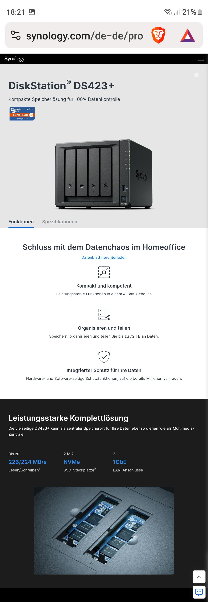
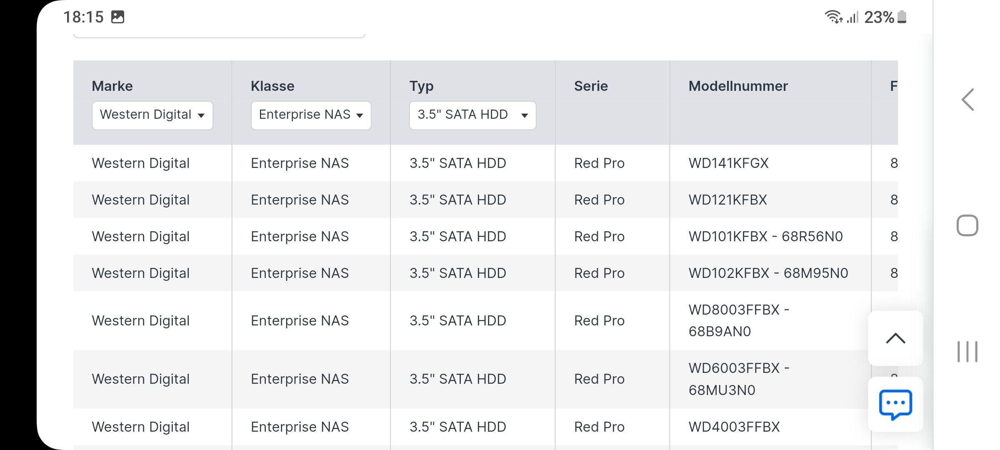

# Synology SME 

Heavy 

## Synology DiskStation 
<https://www.synology.com/de-de/products/DS423+>

- RAM erweiterbar
- uvam. 

# Festplatten, 2x besser 3x
3 x hdd, 3.5 ''
Wd red pro, z. B. 10 tb 

<https://www.synology.com/de-de/compatibility?search_by=category&category=hdds_no_ssd_trim>

## Syno Drive

- Ordner feigeben und syno drive aktivieren, Nutzer anlegen 
- anmelden online oder Portfreigaben einstellen
- Auf den clients syno drive installieren, Benutzer angeben, synchronisieren
## Syno Backup

- entweder in die cloud: Google, Microsoft, Amazon
- oder 2. Syno Station  am 2. Standort und syno Backup einrichten

