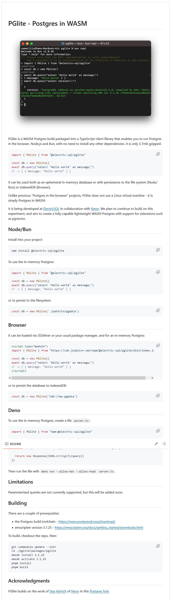

# PGlite - Postgres in WASM

PGlite is a WASM Postgres build packaged into a TypeScript client library that enables you to run Postgres in the browser, Node.js and Bun, with no need to install any other dependencies. It is only 3.7mb gzipped.

<https://github.com/electric-sql/pglite>