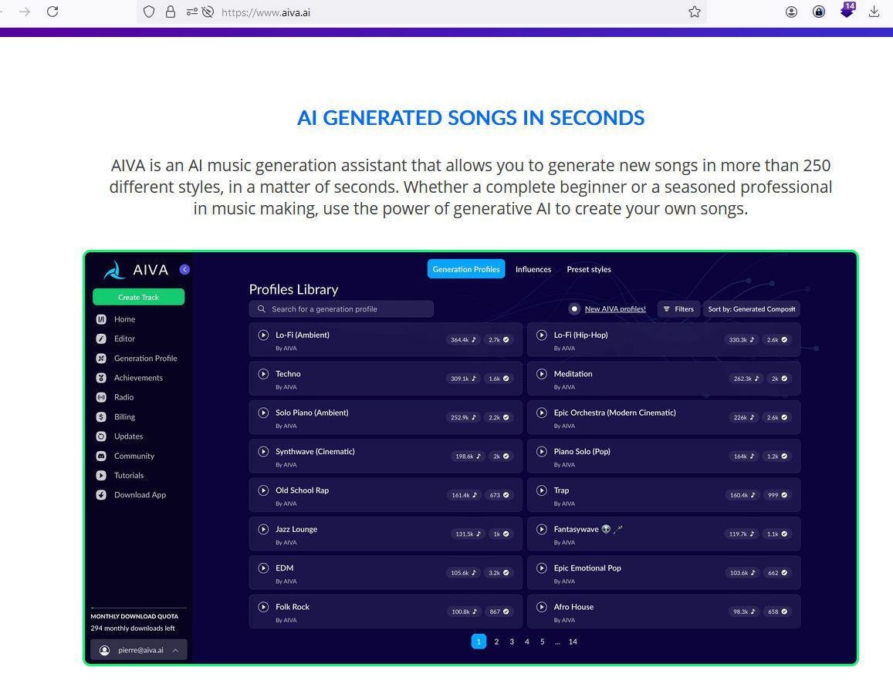
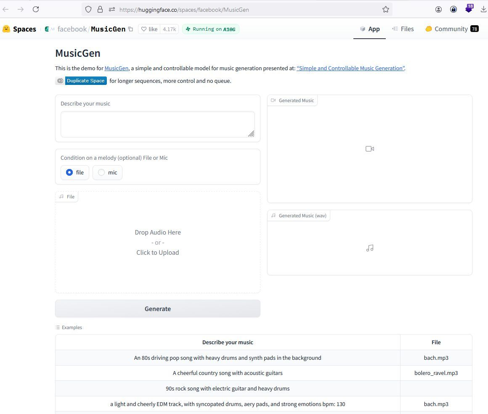
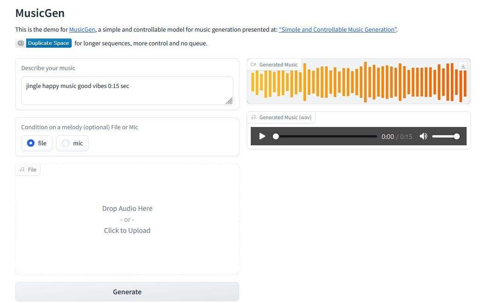
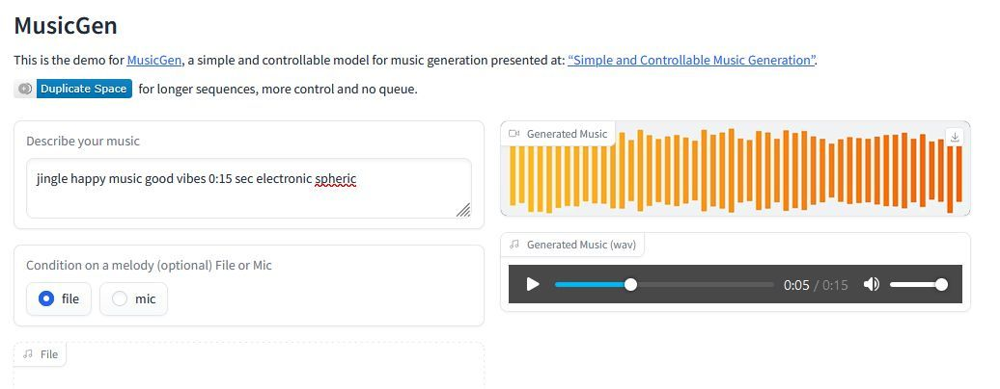

# KI-Musikproduzenten im Vergleich

- Aiva
- MusicGen
- Riffusion
- Stable Audio
- Soundful
- Soundraw
- Suno


## www.aiva.ai



## www.huggingface.co/spaces/facebook/MusicGen	



```
jingle happy music good vibes 0:15 sec
```





<figure class="video_container">
  <video width="100%"  controls="true" allowfullscreen="true"  poster="../_asset/2024-02-24-kiMusik_image_3.jpg">
    <source src="../_asset/2024-02-24-kiMusik_video_1.mp4" type="video/mp4">
  </video>
</figure>

```
jingle happy music good vibes 0:15 sec electronic spheric 
```




<figure class="video_container">
  <video width="100%"  controls="true" allowfullscreen="true"  poster="../_asset/2024-02-24-kiMusik_image_4.jpg">
    <source src="../_asset/2024-02-24-kiMusik_video_2.mp4" type="video/mp4">
  </video>
</figure>

## www.riffusion.com	

## www.stableaudio.com	
## www.soundful.com	

## www.soundraw.io	

## www.suno.ai

Länge der Musikstücke	bis zu 5:30 Minuten	15 bis 30 Sekunden	wenige Sekunden	45 bis 90 Sekunden	mehrere Minuten	bis zu 5 Minuten 	30 Sekunden/1 Minute
Preise pro Monat	0 Euro/11 Euro/33 Euro	kostenlos	kostenlos	0 Euro/12 Euro/30 Euro/90 Euro	0 Dollar/5 Dollar/10 Dollar	0 Dollar/17 Dollar/30 Dollar	0 Dollar/8 Dollar/24 Dollar


## Links

<https://www.heise.de/tests/Sieben-KI-Komponisten-im-Vergleich-Musik-erzeugen-mit-KI-9620014.html>
