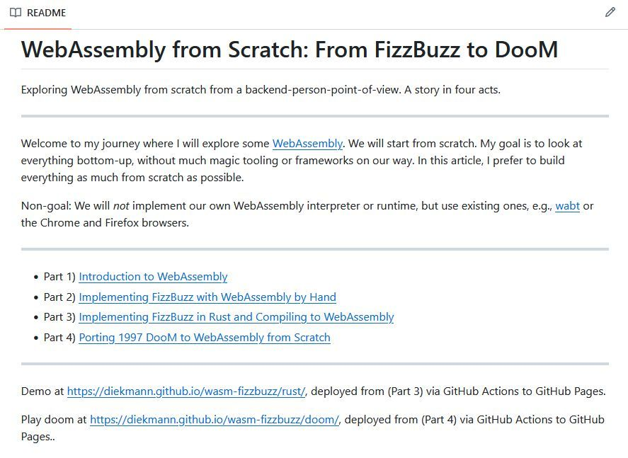
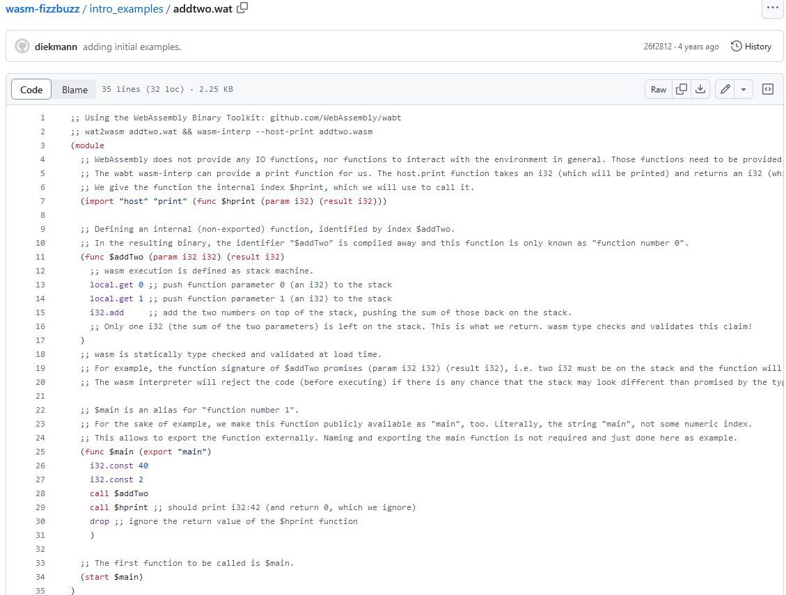

# WebAssembly from Scratch: From FizzBuzz to DooM

Exploring WebAssembly from scratch from a backend-person-point-of-view. A story in four  acts.
Welcome to my journey where I will explore some [WebAssembly](https://webassembly.org/). We will start from scratch. My goal is to look at everything bottom-up, without much magic tooling or frameworks on our way. In this article, I prefer to build everything as much from scratch as possible.

Non-goal: We will _not_ implement our own WebAssembly interpreter or runtime, but use existing ones, e.g., [wabt](https://github.com/WebAssembly/wabt) or the Chrome and Firefox browsers.

<https://github.com/diekmann/wasm-fizzbuzz>