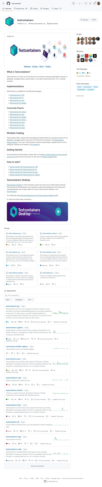

# Testcontainers
<https://github.com/testcontainers/>

Testcontainers is an open source framework for providing throwaway, lightweight instances of databases, message brokers, web browsers, or just about anything that can run in a Docker container.

