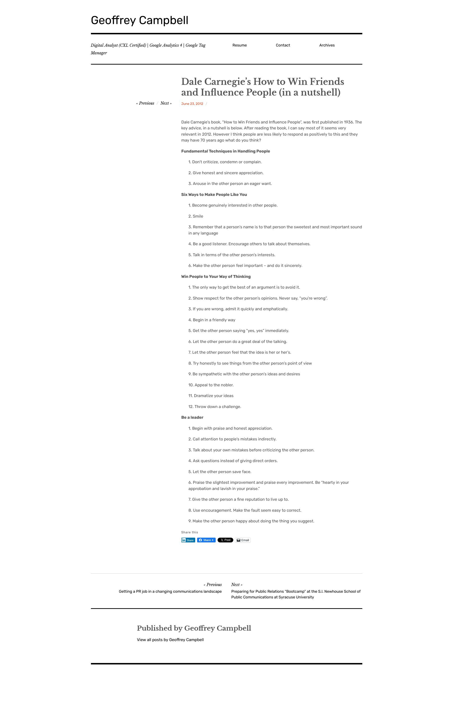

# Dale Carnegie, How to Win Friends and Influence People

Dale Carnegie’s book, “How to Win Friends and Influence People”, was first published in 1936. The key advice, in a nutshell is below. After reading the book, I can say most of it seems very relevant in 2012. However I think people are less likely to respond as positively to this and they may have 70 years ago what do you think?

## **Fundamental Techniques in Handling People**

| **Fundamental Techniques in Handling People** | **Grundlegende Techniken im Umgang mit Menschen** |
| --- | --- |
| 1. Don’t criticize, condemn or complain.  2. Give honest and sincere appreciation.  3. Arouse in the other person an eager want. | 1. Kritisieren, verurteilen oder beschweren Sie sich nicht.      2. Geben Sie ehrliche und aufrichtige Anerkennung.      3. Wecken Sie in der anderen Person ein sehnsüchtiges Verlangen. |

## **Six Ways to Make People Like You**

1. Become genuinely interested in other people.

2. Smile

3. Remember that a person’s name is to that person the sweetest and most important sound in any language

4. Be a good listener. Encourage others to talk about themselves.

5. Talk in terms of the other person’s interests.

6. Make the other person feel important – and do it sincerely.

## **Win People to Your Way of Thinking**

1. The only way to get the best of an argument is to avoid it.

2. Show respect for the other person’s opinions. Never say, “you’re wrong”.

3. If you are wrong, admit it quickly and emphatically.

4. Begin in a friendly way

5. Get the other person saying “yes, yes” immediately.

6. Let the other person do a great deal of the talking.

7. Let the other person feel that the idea is her or her’s.

8. Try honestly to see things from the other person’s point of view

9. Be sympathetic with the other person’s ideas and desires

10. Appeal to the nobler.

11. Dramatize your ideas

12. Throw down a challenge.

## **Be a leader**

1. Begin with praise and honest appreciation.

2. Call attention to people’s mistakes indirectly.

3. Talk about your own mistakes before criticizing the other person.

4. Ask questions instead of giving direct orders.

5. Let the other person save face.

6. Praise the slightest improvement and praise every improvement. Be “hearty in your approbation and lavish in your praise.”

7. Give the other person a fine reputation to live up to.

8. Use encouragement. Make the fault seem easy to correct.

9. Make the other person happy about doing the thing you suggest.

<https://geoffbcampbell.com/2012/06/23/dale-carnegies-how-to-win-friends-and-influence-people-in-a-nutshell/>
