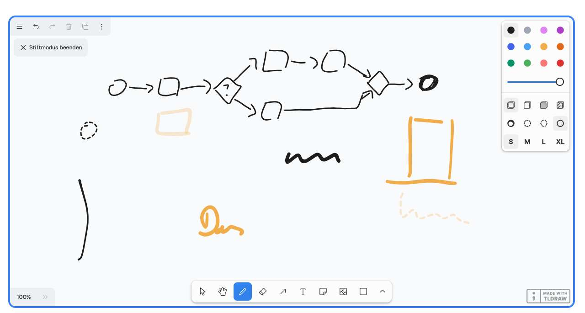

# TLDraw

https://makereal.tldraw.com/?mj_campaign=nl_ref&mj_content=zeitde_text_link_x&mj_medium=nl&mj_source=int_zonaudev_Nat%C3%BCrlich%20intelligent

# The infinite canvas SDK  
for React developers

Use the **tldraw SDK** to add a collaborative whiteboard to your product _or_ use its components, runtime APIs, services to build your own canvas-based experiences on the web.

tldraw is an [infinite canvas SDK](https://tldraw.dev/) for React. 

You can try our collaborative whiteboard demo at [tldraw.com](https://www.tldraw.com/).

If you’re a developer, you can find out more about the SDK at [tldraw.dev](https://tldraw.dev/).

Want to make your own riff on make real? Clone the [make-real-starter](https://github.com/tldraw/make-real-starter) repo

<https://github.com/tldraw/tldraw>

