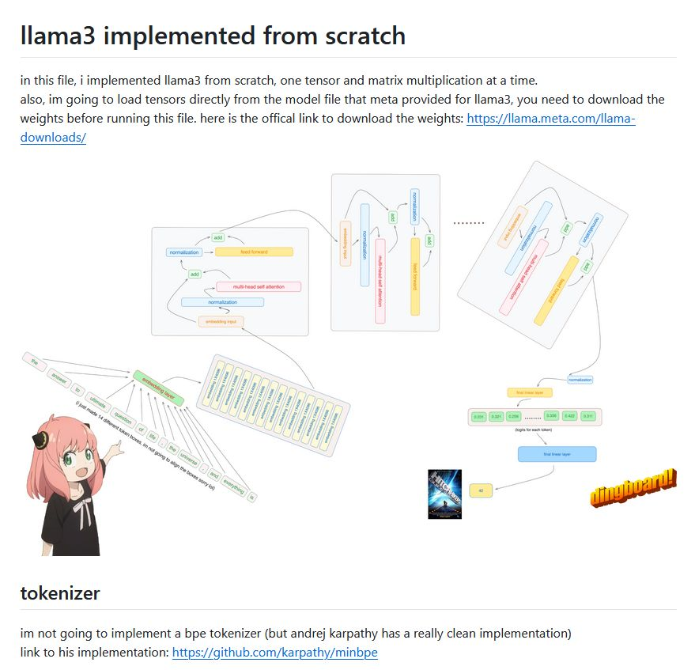

# llama3 implemented from scratch

in this file, i implemented llama3 from scratch, one tensor and matrix multiplication at a time.
also, im going to load tensors directly from the model file that meta provided for llama3, you need to download the weights before running this file. here is the offical link to download the weights: 

https://llama.meta.com/llama-downloads/

https://github.com/naklecha/llama3-from-scratch

