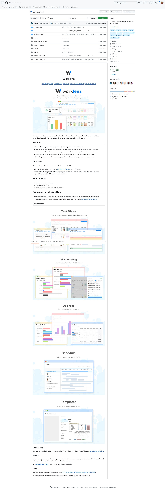

Worklenz is a project management tool designed to help organizations improve their efficiency. It provides a comprehensive solution for managing projects, tasks, and collaboration within teams.

<https://github.com/Worklenz/worklenz>

<https://github.com/naklecha/llama3-from-scratch>

