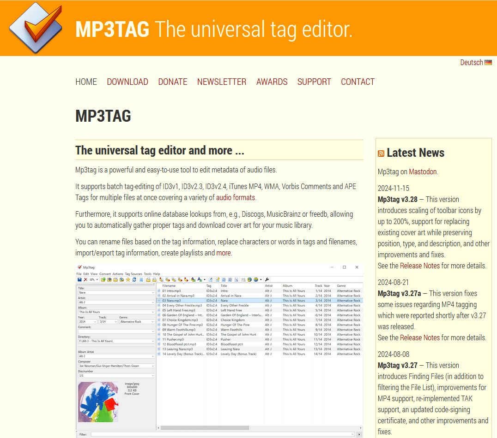

# MP3TAG
https://www.mp3tag.de/en/

MP3TAG
The universal tag editor and more ...
Mp3tag is a powerful and easy-to-use tool to edit metadata of audio files.

It supports batch tag-editing of ID3v1, ID3v2.3, ID3v2.4, iTunes MP4, WMA, Vorbis Comments and APE Tags for multiple files at once covering a variety of audio formats.

Furthermore, it supports online database lookups from, e.g., Discogs, MusicBrainz or freedb, allowing you to automatically gather proper tags and download cover art for your music library.