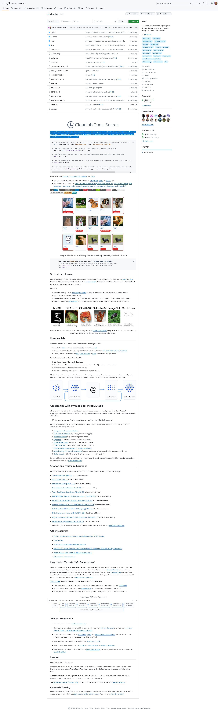

# Cleanlab OSS

cleanlab helps you **clean** data and **lab**els by automatically detecting issues in a ML dataset. To facilitate **machine learning with messy, real-world data**, this data-centric AI package uses your _existing_ models to estimate dataset problems that can be fixed to train even _better_ models.

https://github.com/cleanlab/cleanlab

