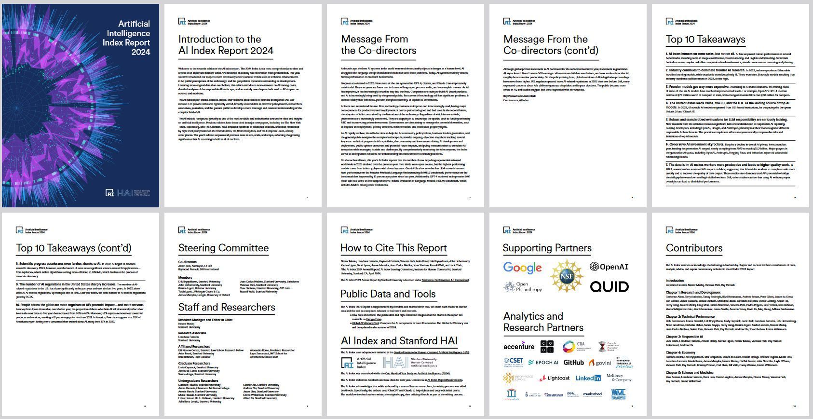

# ## THE AI INDEX REPORT Measuring  trends in AI

Welcome to the seventh edition of the AI Index report. The 2024 Index is our most comprehensive to date and arrives at an important moment when AI’s influence on society has never been more pronounced. This year, we have broadened our scope to more extensively cover essential trends such as technical advancements in AI, public perceptions of the technology, and the geopolitical dynamics surrounding its development. Featuring more original data than ever before, this edition introduces new estimates on AI training costs, detailed analyses of the responsible AI landscape, and an entirely new chapter dedicated to AI’s impact on science and medicine.  
  
The AI Index report tracks, collates, distills, and visualizes data related to artificial intelligence (AI). Our mission is to provide unbiased, rigorously vetted, broadly sourced data in order for policymakers, researchers, executives, journalists, and the general public to develop a more thorough and nuanced understanding of the complex field of AI.

https://aiindex.stanford.edu/wp-content/uploads/2024/05/HAI_AI-Index-Report-2024.pdf