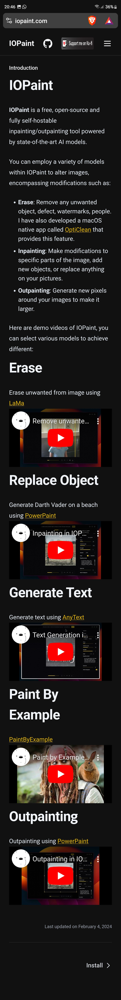
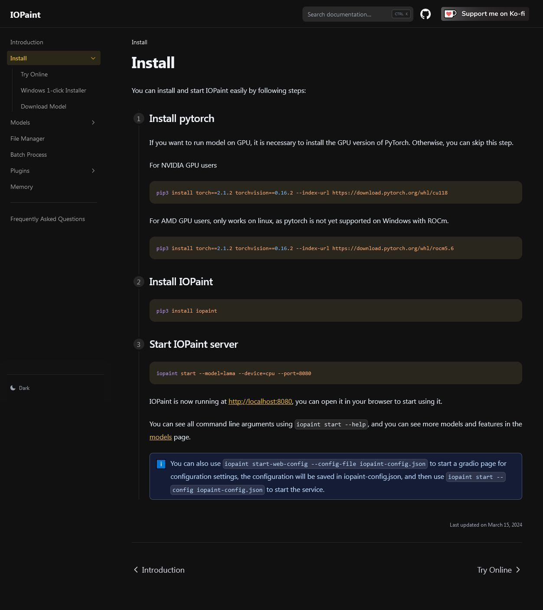
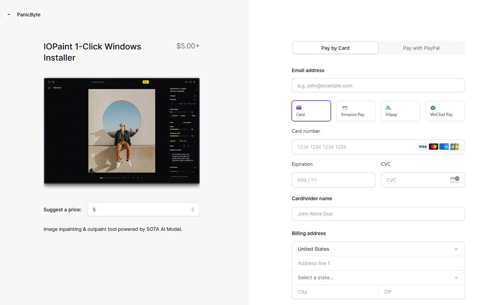
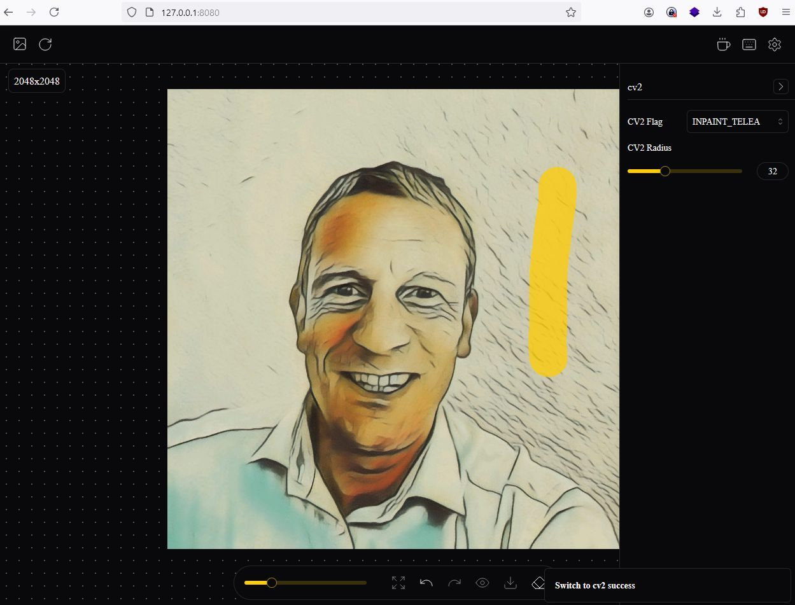

# IOPaint

**IOPaint** is a free, open-source and fully self-hostable inpainting/outpainting tool powered by state-of-the-art AI models.

You can employ a variety of models within IOPaint to alter images, encompassing modifications such as:

- **Erase**: Remove any unwanted object, defect, watermarks, people. I have also developed a macOS native app called [OptiClean (opens in a new tab)](https://opticlean.io/) that provides this feature.
- **Inpainting**: Make modifications to specific parts of the image, add new objects, or replace anything on your pictures.
- **Outpainting**: Generate new pixels around your images to make it larger.

Here are demo videos of IOPaint, you can select various models to achieve different:








## Try Experiment 

``` powershell
(base) PS D:\devops\IOPaint> pip3 install torch==2.1.2 torchvision==0.16.2 --index-url https://download.pytorch.org/whl/cu118
Looking in indexes: https://download.pytorch.org/whl/cu118, https://pypi.ngc.nvidia.com
Collecting torch==2.1.2
  Downloading https://download.pytorch.org/whl/cu118/torch-2.1.2%2Bcu118-cp310-cp310-win_amd64.whl (2722.7 MB)
     ━━━━━━━━━━━━━━━━━━━━━━━━━━━━━━━━━━━━━━━━ 2.7/2.7 GB 59.8 MB/s eta 0:00:00
Collecting torchvision==0.16.2
  Downloading https://download.pytorch.org/whl/cu118/torchvision-0.16.2%2Bcu118-cp310-cp310-win_amd64.whl (4.9 MB)
     ━━━━━━━━━━━━━━━━━━━━━━━━━━━━━━━━━━━━━━━━ 4.9/4.9 MB 52.4 MB/s eta 0:00:00
Collecting typing-extensions
  Downloading https://download.pytorch.org/whl/typing_extensions-4.9.0-py3-none-any.whl (32 kB)
Collecting sympy
  Downloading https://download.pytorch.org/whl/sympy-1.12-py3-none-any.whl (5.7 MB)
     ━━━━━━━━━━━━━━━━━━━━━━━━━━━━━━━━━━━━━━━━ 5.7/5.7 MB 61.0 MB/s eta 0:00:00
Collecting networkx
  Downloading https://download.pytorch.org/whl/networkx-3.2.1-py3-none-any.whl (1.6 MB)
     ━━━━━━━━━━━━━━━━━━━━━━━━━━━━━━━━━━━━━━━━ 1.6/1.6 MB 51.2 MB/s eta 0:00:00
Collecting jinja2
  Downloading https://download.pytorch.org/whl/Jinja2-3.1.3-py3-none-any.whl (133 kB)
     ━━━━━━━━━━━━━━━━━━━━━━━━━━━━━━━━━━━━━━━━ 133.2/133.2 kB 7.7 MB/s eta 0:00:00
Collecting filelock
  Downloading https://download.pytorch.org/whl/filelock-3.13.1-py3-none-any.whl (11 kB)
Collecting fsspec
  Downloading https://download.pytorch.org/whl/fsspec-2024.2.0-py3-none-any.whl (170 kB)
     ━━━━━━━━━━━━━━━━━━━━━━━━━━━━━━━━━━━━━━━━ 170.9/170.9 kB ? eta 0:00:00
Collecting requests
  Downloading https://download.pytorch.org/whl/requests-2.28.1-py3-none-any.whl (62 kB)
     ━━━━━━━━━━━━━━━━━━━━━━━━━━━━━━━━━━━━━━━━ 62.8/62.8 kB ? eta 0:00:00
Collecting numpy
  Downloading https://download.pytorch.org/whl/numpy-1.26.3-cp310-cp310-win_amd64.whl (15.8 MB)
     ━━━━━━━━━━━━━━━━━━━━━━━━━━━━━━━━━━━━━━━━ 15.8/15.8 MB 59.5 MB/s eta 0:00:00
Collecting pillow!=8.3.*,>=5.3.0
  Downloading https://download.pytorch.org/whl/pillow-10.2.0-cp310-cp310-win_amd64.whl (2.6 MB)
     ━━━━━━━━━━━━━━━━━━━━━━━━━━━━━━━━━━━━━━━━ 2.6/2.6 MB 55.6 MB/s eta 0:00:00
Collecting MarkupSafe>=2.0
Collecting idna<4,>=2.5
  Downloading https://download.pytorch.org/whl/idna-3.4-py3-none-any.whl (61 kB)
     ━━━━━━━━━━━━━━━━━━━━━━━━━━━━━━━━━━━━━━━━ 61.5/61.5 kB ? eta 0:00:00
Collecting certifi>=2017.4.17
  Downloading https://download.pytorch.org/whl/certifi-2022.12.7-py3-none-any.whl (155 kB)
     ━━━━━━━━━━━━━━━━━━━━━━━━━━━━━━━━━━━━━━━━ 155.3/155.3 kB ? eta 0:00:00
Collecting urllib3<1.27,>=1.21.1
  Downloading https://download.pytorch.org/whl/urllib3-1.26.13-py2.py3-none-any.whl (140 kB)
     ━━━━━━━━━━━━━━━━━━━━━━━━━━━━━━━━━━━━━━━━ 140.6/140.6 kB ? eta 0:00:00
Collecting charset-normalizer<3,>=2
  Downloading https://download.pytorch.org/whl/charset_normalizer-2.1.1-py3-none-any.whl (39 kB)
Collecting mpmath>=0.19
  Downloading https://download.pytorch.org/whl/mpmath-1.3.0-py3-none-any.whl (536 kB)
     ━━━━━━━━━━━━━━━━━━━━━━━━━━━━━━━━━━━━━━━━ 536.2/536.2 kB ? eta 0:00:00
Installing collected packages: mpmath, urllib3, typing-extensions, sympy, pillow, numpy, networkx, MarkupSafe, idna, fsspec, filelock, charset-normalizer, certifi, requests, jinja2, torch, torchvision
Successfully installed MarkupSafe-2.1.5 certifi-2022.12.7 charset-normalizer-2.1.1 filelock-3.13.1 fsspec-2024.2.0 idna-3.4 jinja2-3.1.3 mpmath-1.3.0 networkx-3.2.1 numpy-1.26.3 pillow-10.2.0 requests-2.28.1 sympy-1.12 torch-2.1.2+cu118 torchvision-0.16.2+cu118 typing-extensions-4.9.0 urllib3-1.26.13

```


``` powershell
(base) PS D:\devops\IOPaint> pip3 install iopaint
Looking in indexes: https://pypi.org/simple, https://pypi.ngc.nvidia.com
Collecting iopaint
  Downloading IOPaint-1.3.3-py3-none-any.whl (5.9 MB)
     ━━━━━━━━━━━━━━━━━━━━━━━━━━━━━━━━━━━━━━━━ 5.9/5.9 MB 5.4 MB/s eta 0:00:00
Collecting uvicorn
  Downloading uvicorn-0.30.1-py3-none-any.whl (62 kB)
     ━━━━━━━━━━━━━━━━━━━━━━━━━━━━━━━━━━━━━━━━ 62.4/62.4 kB ? eta 0:00:00
Collecting safetensors
  Downloading safetensors-0.4.3-cp310-none-win_amd64.whl (287 kB)
     ━━━━━━━━━━━━━━━━━━━━━━━━━━━━━━━━━━━━━━━━ 287.4/287.4 kB 18.5 MB/s eta 0:00:00
Collecting yacs
  Downloading yacs-0.1.8-py3-none-any.whl (14 kB)
Collecting typer-config==1.4.0
  Downloading typer_config-1.4.0-py3-none-any.whl (11 kB)
Collecting python-multipart
  Downloading python_multipart-0.0.9-py3-none-any.whl (22 kB)
Collecting transformers>=4.35.1
  Downloading transformers-4.41.2-py3-none-any.whl (9.1 MB)
     ━━━━━━━━━━━━━━━━━━━━━━━━━━━━━━━━━━━━━━━━ 9.1/9.1 MB 19.4 MB/s eta 0:00:00
Collecting controlnet-aux==0.0.3
  Downloading controlnet_aux-0.0.3-py3-none-any.whl (122 kB)
     ━━━━━━━━━━━━━━━━━━━━━━━━━━━━━━━━━━━━━━━━ 122.9/122.9 kB ? eta 0:00:00
Collecting Pillow==9.5.0
  Downloading Pillow-9.5.0-cp310-cp310-win_amd64.whl (2.5 MB)
     ━━━━━━━━━━━━━━━━━━━━━━━━━━━━━━━━━━━━━━━━ 2.5/2.5 MB 32.1 MB/s eta 0:00:00
Collecting piexif==1.1.3
  Downloading piexif-1.1.3-py2.py3-none-any.whl (20 kB)
Collecting pydantic>=2.5.2
  Downloading pydantic-2.7.4-py3-none-any.whl (409 kB)
     ━━━━━━━━━━━━━━━━━━━━━━━━━━━━━━━━━━━━━━━━ 409.0/409.0 kB ? eta 0:00:00
Collecting opencv-python
  Downloading opencv_python-4.10.0.84-cp37-abi3-win_amd64.whl (38.8 MB)
     ━━━━━━━━━━━━━━━━━━━━━━━━━━━━━━━━━━━━━━━━ 38.8/38.8 MB 54.7 MB/s eta 0:00:00
Collecting peft==0.7.1
  Downloading peft-0.7.1-py3-none-any.whl (168 kB)
     ━━━━━━━━━━━━━━━━━━━━━━━━━━━━━━━━━━━━━━━━ 168.3/168.3 kB ? eta 0:00:00
Collecting python-socketio==5.7.2
  Downloading python_socketio-5.7.2-py3-none-any.whl (56 kB)
     ━━━━━━━━━━━━━━━━━━━━━━━━━━━━━━━━━━━━━━━━ 56.7/56.7 kB ? eta 0:00:00
Collecting typer
  Downloading typer-0.12.3-py3-none-any.whl (47 kB)
     ━━━━━━━━━━━━━━━━━━━━━━━━━━━━━━━━━━━━━━━━ 47.2/47.2 kB ? eta 0:00:00
Collecting accelerate
  Downloading accelerate-0.31.0-py3-none-any.whl (309 kB)
     ━━━━━━━━━━━━━━━━━━━━━━━━━━━━━━━━━━━━━━━━ 309.4/309.4 kB ? eta 0:00:00
Collecting fastapi==0.108.0
  Downloading fastapi-0.108.0-py3-none-any.whl (92 kB)
     ━━━━━━━━━━━━━━━━━━━━━━━━━━━━━━━━━━━━━━━━ 92.0/92.0 kB ? eta 0:00:00
Collecting diffusers==0.27.2
  Downloading diffusers-0.27.2-py3-none-any.whl (2.0 MB)
     ━━━━━━━━━━━━━━━━━━━━━━━━━━━━━━━━━━━━━━━━ 2.0/2.0 MB 42.9 MB/s eta 0:00:00
Collecting omegaconf
  Downloading omegaconf-2.3.0-py3-none-any.whl (79 kB)
     ━━━━━━━━━━━━━━━━━━━━━━━━━━━━━━━━━━━━━━━━ 79.5/79.5 kB ? eta 0:00:00
Collecting rich
  Downloading rich-13.7.1-py3-none-any.whl (240 kB)
     ━━━━━━━━━━━━━━━━━━━━━━━━━━━━━━━━━━━━━━━━ 240.7/240.7 kB ? eta 0:00:00
Collecting gradio==4.21.0
  Downloading gradio-4.21.0-py3-none-any.whl (17.0 MB)
     ━━━━━━━━━━━━━━━━━━━━━━━━━━━━━━━━━━━━━━━━ 17.0/17.0 MB 59.5 MB/s eta 0:00:00
Requirement already satisfied: torch>=2.0.0 in d:\devops\iopaint\venviopaint\lib\site-packages (from iopaint) (2.1.2+cu118)
Collecting easydict
  Downloading easydict-1.13-py3-none-any.whl (6.8 kB)
Collecting loguru
  Downloading loguru-0.7.2-py3-none-any.whl (62 kB)
     ━━━━━━━━━━━━━━━━━━━━━━━━━━━━━━━━━━━━━━━━ 62.5/62.5 kB ? eta 0:00:00
Collecting scikit-image
  Downloading scikit_image-0.24.0-cp310-cp310-win_amd64.whl (12.9 MB)
     ━━━━━━━━━━━━━━━━━━━━━━━━━━━━━━━━━━━━━━━━ 12.9/12.9 MB 54.7 MB/s eta 0:00:00
Collecting huggingface-hub
  Downloading huggingface_hub-0.23.4-py3-none-any.whl (402 kB)
     ━━━━━━━━━━━━━━━━━━━━━━━━━━━━━━━━━━━━━━━━ 402.6/402.6 kB ? eta 0:00:00
Requirement already satisfied: torchvision in d:\devops\iopaint\venviopaint\lib\site-packages (from controlnet-aux==0.0.3->iopaint) (0.16.2+cu118)
Collecting importlib-metadata
  Downloading importlib_metadata-7.2.1-py3-none-any.whl (25 kB)
Collecting scipy
  Downloading scipy-1.14.0-cp310-cp310-win_amd64.whl (44.8 MB)
     ━━━━━━━━━━━━━━━━━━━━━━━━━━━━━━━━━━━━━━━━ 44.8/44.8 MB 43.7 MB/s eta 0:00:00
Collecting timm
  Downloading timm-1.0.7-py3-none-any.whl (2.3 MB)
     ━━━━━━━━━━━━━━━━━━━━━━━━━━━━━━━━━━━━━━━━ 2.3/2.3 MB 36.4 MB/s eta 0:00:00
Collecting einops
  Downloading einops-0.8.0-py3-none-any.whl (43 kB)
     ━━━━━━━━━━━━━━━━━━━━━━━━━━━━━━━━━━━━━━━━ 43.2/43.2 kB ? eta 0:00:00
Requirement already satisfied: numpy in d:\devops\iopaint\venviopaint\lib\site-packages (from controlnet-aux==0.0.3->iopaint) (1.26.3)
Requirement already satisfied: filelock in d:\devops\iopaint\venviopaint\lib\site-packages (from controlnet-aux==0.0.3->iopaint) (3.13.1)
Requirement already satisfied: requests in d:\devops\iopaint\venviopaint\lib\site-packages (from diffusers==0.27.2->iopaint) (2.28.1)
Collecting regex!=2019.12.17
  Downloading regex-2024.5.15-cp310-cp310-win_amd64.whl (268 kB)
     ━━━━━━━━━━━━━━━━━━━━━━━━━━━━━━━━━━━━━━━━ 269.0/269.0 kB ? eta 0:00:00
Collecting starlette<0.33.0,>=0.29.0
  Downloading starlette-0.32.0.post1-py3-none-any.whl (70 kB)
     ━━━━━━━━━━━━━━━━━━━━━━━━━━━━━━━━━━━━━━━━ 70.0/70.0 kB ? eta 0:00:00
Requirement already satisfied: typing-extensions>=4.8.0 in d:\devops\iopaint\venviopaint\lib\site-packages (from fastapi==0.108.0->iopaint) (4.9.0)
Collecting pandas<3.0,>=1.0
  Downloading pandas-2.2.2-cp310-cp310-win_amd64.whl (11.6 MB)
     ━━━━━━━━━━━━━━━━━━━━━━━━━━━━━━━━━━━━━━━━ 11.6/11.6 MB 54.4 MB/s eta 0:00:00
Collecting orjson~=3.0
  Downloading orjson-3.10.5-cp310-none-win_amd64.whl (141 kB)
     ━━━━━━━━━━━━━━━━━━━━━━━━━━━━━━━━━━━━━━━━ 141.3/141.3 kB ? eta 0:00:00
Collecting gradio-client==0.12.0
  Downloading gradio_client-0.12.0-py3-none-any.whl (310 kB)
     ━━━━━━━━━━━━━━━━━━━━━━━━━━━━━━━━━━━━━━━━ 310.7/310.7 kB ? eta 0:00:00
Collecting pyyaml<7.0,>=5.0
  Downloading PyYAML-6.0.1-cp310-cp310-win_amd64.whl (145 kB)
     ━━━━━━━━━━━━━━━━━━━━━━━━━━━━━━━━━━━━━━━━ 145.3/145.3 kB ? eta 0:00:00
Requirement already satisfied: markupsafe~=2.0 in d:\devops\iopaint\venviopaint\lib\site-packages (from gradio==4.21.0->iopaint) (2.1.5)
Collecting tomlkit==0.12.0
  Downloading tomlkit-0.12.0-py3-none-any.whl (37 kB)
Requirement already satisfied: jinja2<4.0 in d:\devops\iopaint\venviopaint\lib\site-packages (from gradio==4.21.0->iopaint) (3.1.3)
Collecting semantic-version~=2.0
  Downloading semantic_version-2.10.0-py2.py3-none-any.whl (15 kB)
Collecting ruff>=0.2.2
  Downloading ruff-0.4.10-py3-none-win_amd64.whl (8.5 MB)
     ━━━━━━━━━━━━━━━━━━━━━━━━━━━━━━━━━━━━━━━━ 8.5/8.5 MB 60.3 MB/s eta 0:00:00
Collecting packaging
  Downloading packaging-24.1-py3-none-any.whl (53 kB)
     ━━━━━━━━━━━━━━━━━━━━━━━━━━━━━━━━━━━━━━━━ 54.0/54.0 kB ? eta 0:00:00
Collecting httpx>=0.24.1
  Downloading httpx-0.27.0-py3-none-any.whl (75 kB)
     ━━━━━━━━━━━━━━━━━━━━━━━━━━━━━━━━━━━━━━━━ 75.6/75.6 kB ? eta 0:00:00
Collecting aiofiles<24.0,>=22.0
  Downloading aiofiles-23.2.1-py3-none-any.whl (15 kB)
Collecting altair<6.0,>=4.2.0
  Downloading altair-5.3.0-py3-none-any.whl (857 kB)
     ━━━━━━━━━━━━━━━━━━━━━━━━━━━━━━━━━━━━━━━━ 857.8/857.8 kB 53.0 MB/s eta 0:00:00
Collecting pydub
  Downloading pydub-0.25.1-py2.py3-none-any.whl (32 kB)
Collecting ffmpy
  Downloading ffmpy-0.3.2.tar.gz (5.5 kB)
  Preparing metadata (setup.py) ... done
Collecting importlib-resources<7.0,>=1.3
  Downloading importlib_resources-6.4.0-py3-none-any.whl (38 kB)
Collecting matplotlib~=3.0
  Downloading matplotlib-3.9.0-cp310-cp310-win_amd64.whl (8.0 MB)
     ━━━━━━━━━━━━━━━━━━━━━━━━━━━━━━━━━━━━━━━━ 8.0/8.0 MB 56.3 MB/s eta 0:00:00
Collecting tqdm
  Downloading tqdm-4.66.4-py3-none-any.whl (78 kB)
     ━━━━━━━━━━━━━━━━━━━━━━━━━━━━━━━━━━━━━━━━ 78.3/78.3 kB ? eta 0:00:00
Collecting psutil
  Downloading psutil-6.0.0-cp37-abi3-win_amd64.whl (257 kB)
     ━━━━━━━━━━━━━━━━━━━━━━━━━━━━━━━━━━━━━━━━ 257.4/257.4 kB ? eta 0:00:00
Collecting bidict>=0.21.0
  Downloading bidict-0.23.1-py3-none-any.whl (32 kB)
Collecting python-engineio>=4.3.0
  Downloading python_engineio-4.9.1-py3-none-any.whl (57 kB)
     ━━━━━━━━━━━━━━━━━━━━━━━━━━━━━━━━━━━━━━━━ 57.7/57.7 kB ? eta 0:00:00
Collecting websockets<12.0,>=10.0
  Downloading websockets-11.0.3-cp310-cp310-win_amd64.whl (124 kB)
     ━━━━━━━━━━━━━━━━━━━━━━━━━━━━━━━━━━━━━━━━ 124.7/124.7 kB ? eta 0:00:00
Requirement already satisfied: fsspec in d:\devops\iopaint\venviopaint\lib\site-packages (from gradio-client==0.12.0->gradio==4.21.0->iopaint) (2024.2.0)
Collecting annotated-types>=0.4.0
  Downloading annotated_types-0.7.0-py3-none-any.whl (13 kB)
Collecting pydantic-core==2.18.4
  Downloading pydantic_core-2.18.4-cp310-none-win_amd64.whl (1.9 MB)
     ━━━━━━━━━━━━━━━━━━━━━━━━━━━━━━━━━━━━━━━━ 1.9/1.9 MB 59.4 MB/s eta 0:00:00
Requirement already satisfied: networkx in d:\devops\iopaint\venviopaint\lib\site-packages (from torch>=2.0.0->iopaint) (3.2.1)
Requirement already satisfied: sympy in d:\devops\iopaint\venviopaint\lib\site-packages (from torch>=2.0.0->iopaint) (1.12)
Collecting tokenizers<0.20,>=0.19
  Downloading tokenizers-0.19.1-cp310-none-win_amd64.whl (2.2 MB)
     ━━━━━━━━━━━━━━━━━━━━━━━━━━━━━━━━━━━━━━━━ 2.2/2.2 MB 71.3 MB/s eta 0:00:00
Collecting shellingham>=1.3.0
  Downloading shellingham-1.5.4-py2.py3-none-any.whl (9.8 kB)
Collecting click>=8.0.0
  Downloading click-8.1.7-py3-none-any.whl (97 kB)
     ━━━━━━━━━━━━━━━━━━━━━━━━━━━━━━━━━━━━━━━━ 97.9/97.9 kB ? eta 0:00:00
Collecting markdown-it-py>=2.2.0
  Downloading markdown_it_py-3.0.0-py3-none-any.whl (87 kB)
     ━━━━━━━━━━━━━━━━━━━━━━━━━━━━━━━━━━━━━━━━ 87.5/87.5 kB ? eta 0:00:00
Collecting pygments<3.0.0,>=2.13.0
  Downloading pygments-2.18.0-py3-none-any.whl (1.2 MB)
     ━━━━━━━━━━━━━━━━━━━━━━━━━━━━━━━━━━━━━━━━ 1.2/1.2 MB 37.4 MB/s eta 0:00:00
Collecting h11>=0.8
  Downloading h11-0.14.0-py3-none-any.whl (58 kB)
     ━━━━━━━━━━━━━━━━━━━━━━━━━━━━━━━━━━━━━━━━ 58.3/58.3 kB ? eta 0:00:00
Collecting win32-setctime>=1.0.0
  Downloading win32_setctime-1.1.0-py3-none-any.whl (3.6 kB)
Collecting colorama>=0.3.4
  Downloading colorama-0.4.6-py2.py3-none-any.whl (25 kB)
Collecting antlr4-python3-runtime==4.9.*
  Downloading antlr4-python3-runtime-4.9.3.tar.gz (117 kB)
     ━━━━━━━━━━━━━━━━━━━━━━━━━━━━━━━━━━━━━━━━ 117.0/117.0 kB 7.1 MB/s eta 0:00:00
  Preparing metadata (setup.py) ... done
Collecting toolz
  Downloading toolz-0.12.1-py3-none-any.whl (56 kB)
     ━━━━━━━━━━━━━━━━━━━━━━━━━━━━━━━━━━━━━━━━ 56.1/56.1 kB ? eta 0:00:00
Collecting jsonschema>=3.0
  Downloading jsonschema-4.22.0-py3-none-any.whl (88 kB)
     ━━━━━━━━━━━━━━━━━━━━━━━━━━━━━━━━━━━━━━━━ 88.3/88.3 kB ? eta 0:00:00
Collecting httpcore==1.*
  Downloading httpcore-1.0.5-py3-none-any.whl (77 kB)
     ━━━━━━━━━━━━━━━━━━━━━━━━━━━━━━━━━━━━━━━━ 77.9/77.9 kB ? eta 0:00:00
Requirement already satisfied: idna in d:\devops\iopaint\venviopaint\lib\site-packages (from httpx>=0.24.1->gradio==4.21.0->iopaint) (3.4)
Requirement already satisfied: certifi in d:\devops\iopaint\venviopaint\lib\site-packages (from httpx>=0.24.1->gradio==4.21.0->iopaint) (2022.12.7)
Collecting sniffio
  Downloading sniffio-1.3.1-py3-none-any.whl (10 kB)
Collecting anyio
  Downloading anyio-4.4.0-py3-none-any.whl (86 kB)
     ━━━━━━━━━━━━━━━━━━━━━━━━━━━━━━━━━━━━━━━━ 86.8/86.8 kB ? eta 0:00:00
Collecting mdurl~=0.1
  Downloading mdurl-0.1.2-py3-none-any.whl (10.0 kB)
Collecting kiwisolver>=1.3.1
  Downloading kiwisolver-1.4.5-cp310-cp310-win_amd64.whl (56 kB)
     ━━━━━━━━━━━━━━━━━━━━━━━━━━━━━━━━━━━━━━━━ 56.1/56.1 kB ? eta 0:00:00
Collecting pyparsing>=2.3.1
  Downloading pyparsing-3.1.2-py3-none-any.whl (103 kB)
     ━━━━━━━━━━━━━━━━━━━━━━━━━━━━━━━━━━━━━━━━ 103.2/103.2 kB ? eta 0:00:00
Collecting fonttools>=4.22.0
  Downloading fonttools-4.53.0-cp310-cp310-win_amd64.whl (2.2 MB)
     ━━━━━━━━━━━━━━━━━━━━━━━━━━━━━━━━━━━━━━━━ 2.2/2.2 MB 46.7 MB/s eta 0:00:00
Collecting contourpy>=1.0.1
  Downloading contourpy-1.2.1-cp310-cp310-win_amd64.whl (187 kB)
     ━━━━━━━━━━━━━━━━━━━━━━━━━━━━━━━━━━━━━━━━ 187.5/187.5 kB ? eta 0:00:00
Collecting python-dateutil>=2.7
  Downloading python_dateutil-2.9.0.post0-py2.py3-none-any.whl (229 kB)
     ━━━━━━━━━━━━━━━━━━━━━━━━━━━━━━━━━━━━━━━━ 229.9/229.9 kB ? eta 0:00:00
Collecting cycler>=0.10
  Downloading cycler-0.12.1-py3-none-any.whl (8.3 kB)
Collecting pytz>=2020.1
  Downloading pytz-2024.1-py2.py3-none-any.whl (505 kB)
     ━━━━━━━━━━━━━━━━━━━━━━━━━━━━━━━━━━━━━━━━ 505.5/505.5 kB ? eta 0:00:00
Collecting tzdata>=2022.7
  Downloading tzdata-2024.1-py2.py3-none-any.whl (345 kB)
     ━━━━━━━━━━━━━━━━━━━━━━━━━━━━━━━━━━━━━━━━ 345.4/345.4 kB ? eta 0:00:00
Collecting simple-websocket>=0.10.0
  Downloading simple_websocket-1.0.0-py3-none-any.whl (13 kB)
WARNING: typer 0.12.3 does not provide the extra 'all'
Collecting zipp>=0.5
  Downloading zipp-3.19.2-py3-none-any.whl (9.0 kB)
Requirement already satisfied: charset-normalizer<3,>=2 in d:\devops\iopaint\venviopaint\lib\site-packages (from requests->diffusers==0.27.2->iopaint) (2.1.1)
Requirement already satisfied: urllib3<1.27,>=1.21.1 in d:\devops\iopaint\venviopaint\lib\site-packages (from requests->diffusers==0.27.2->iopaint) (1.26.13)
Collecting tifffile>=2022.8.12
  Downloading tifffile-2024.6.18-py3-none-any.whl (226 kB)
     ━━━━━━━━━━━━━━━━━━━━━━━━━━━━━━━━━━━━━━━━ 226.0/226.0 kB ? eta 0:00:00
Collecting imageio>=2.33
  Downloading imageio-2.34.2-py3-none-any.whl (313 kB)
     ━━━━━━━━━━━━━━━━━━━━━━━━━━━━━━━━━━━━━━━━ 313.5/313.5 kB ? eta 0:00:00
Collecting lazy-loader>=0.4
  Downloading lazy_loader-0.4-py3-none-any.whl (12 kB)
Requirement already satisfied: mpmath>=0.19 in d:\devops\iopaint\venviopaint\lib\site-packages (from sympy->torch>=2.0.0->iopaint) (1.3.0)
Collecting exceptiongroup>=1.0.2
  Downloading exceptiongroup-1.2.1-py3-none-any.whl (16 kB)
Collecting referencing>=0.28.4
  Downloading referencing-0.35.1-py3-none-any.whl (26 kB)
Collecting jsonschema-specifications>=2023.03.6
  Downloading jsonschema_specifications-2023.12.1-py3-none-any.whl (18 kB)
Collecting rpds-py>=0.7.1
  Downloading rpds_py-0.18.1-cp310-none-win_amd64.whl (209 kB)
     ━━━━━━━━━━━━━━━━━━━━━━━━━━━━━━━━━━━━━━━━ 209.0/209.0 kB ? eta 0:00:00
Collecting attrs>=22.2.0
  Downloading attrs-23.2.0-py3-none-any.whl (60 kB)
     ━━━━━━━━━━━━━━━━━━━━━━━━━━━━━━━━━━━━━━━━ 60.8/60.8 kB ? eta 0:00:00
Collecting six>=1.5
  Downloading six-1.16.0-py2.py3-none-any.whl (11 kB)
Collecting wsproto
  Downloading wsproto-1.2.0-py3-none-any.whl (24 kB)
Installing collected packages: pytz, pydub, ffmpy, easydict, antlr4-python3-runtime, zipp, win32-setctime, websockets, tzdata, toolz, tomlkit, tifffile, sniffio, six, shellingham, semantic-version, scipy, safetensors, ruff, rpds-py, regex, pyyaml, python-multipart, pyparsing, pygments, pydantic-core, psutil, Pillow, piexif, packaging, orjson, opencv-python, mdurl, kiwisolver, importlib-resources, h11, fonttools, exceptiongroup, einops, cycler, contourpy, colorama, bidict, attrs, annotated-types, aiofiles, yacs, wsproto, tqdm, referencing, python-dateutil, pydantic, omegaconf, markdown-it-py, loguru, lazy-loader, importlib-metadata, imageio, httpcore, click, anyio, uvicorn, starlette, simple-websocket, scikit-image, rich, pandas, matplotlib, jsonschema-specifications, huggingface-hub, httpx, typer, tokenizers, timm, python-engineio, jsonschema, gradio-client, fastapi, diffusers, accelerate, typer-config, transformers, python-socketio, controlnet-aux, altair, peft, gradio, iopaint
  DEPRECATION: ffmpy is being installed using the legacy 'setup.py install' method, because it does not have a 'pyproject.toml' and the 'wheel' package is not installed. pip 23.1 will enforce this behaviour change. A possible replacement is to enable the '--use-pep517' option. Discussion can be found at https://github.com/pypa/pip/issues/8559
  Running setup.py install for ffmpy ... done
  DEPRECATION: antlr4-python3-runtime is being installed using the legacy 'setup.py install' method, because it does not have a 'pyproject.toml' and the 'wheel' package is not installed. pip 23.1 will enforce this behaviour change. A possible replacement is to enable the '--use-pep517' option. Discussion can be found at https://github.com/pypa/pip/issues/8559
  Running setup.py install for antlr4-python3-runtime ... done
  Attempting uninstall: Pillow
    Found existing installation: pillow 10.2.0
    Uninstalling pillow-10.2.0:
      Successfully uninstalled pillow-10.2.0
Successfully installed Pillow-9.5.0 accelerate-0.31.0 aiofiles-23.2.1 altair-5.3.0 annotated-types-0.7.0 antlr4-python3-runtime-4.9.3 anyio-4.4.0 attrs-23.2.0 bidict-0.23.1 click-8.1.7 colorama-0.4.6 contourpy-1.2.1 controlnet-aux-0.0.3 cycler-0.12.1 diffusers-0.27.2 easydict-1.13 einops-0.8.0 exceptiongroup-1.2.1 fastapi-0.108.0 ffmpy-0.3.2 fonttools-4.53.0 gradio-4.21.0 gradio-client-0.12.0 h11-0.14.0 httpcore-1.0.5 httpx-0.27.0 huggingface-hub-0.23.4 imageio-2.34.2 importlib-metadata-7.2.1 importlib-resources-6.4.0 iopaint-1.3.3 jsonschema-4.22.0 jsonschema-specifications-2023.12.1 kiwisolver-1.4.5 lazy-loader-0.4 loguru-0.7.2 markdown-it-py-3.0.0 matplotlib-3.9.0 mdurl-0.1.2 omegaconf-2.3.0 opencv-python-4.10.0.84 orjson-3.10.5 packaging-24.1 pandas-2.2.2 peft-0.7.1 piexif-1.1.3 psutil-6.0.0 pydantic-2.7.4 pydantic-core-2.18.4 pydub-0.25.1 pygments-2.18.0 pyparsing-3.1.2 python-dateutil-2.9.0.post0 python-engineio-4.9.1 python-multipart-0.0.9 python-socketio-5.7.2 pytz-2024.1 pyyaml-6.0.1 referencing-0.35.1 regex-2024.5.15 rich-13.7.1 rpds-py-0.18.1 ruff-0.4.10 safetensors-0.4.3 scikit-image-0.24.0 scipy-1.14.0 semantic-version-2.10.0 shellingham-1.5.4 simple-websocket-1.0.0 six-1.16.0 sniffio-1.3.1 starlette-0.32.0.post1 tifffile-2024.6.18 timm-1.0.7 tokenizers-0.19.1 tomlkit-0.12.0 toolz-0.12.1 tqdm-4.66.4 transformers-4.41.2 typer-0.12.3 typer-config-1.4.0 tzdata-2024.1 uvicorn-0.30.1 websockets-11.0.3 win32-setctime-1.1.0 wsproto-1.2.0 yacs-0.1.8 zipp-3.19.2

[notice] A new release of pip is available: 23.0.1 -> 24.1
[notice] To update, run: python.exe -m pip install --upgrade pip
(base) PS D:\devops\IOPaint> 

```


``` powershell 
(base) PS D:\devops\IOPaint> iopaint start --model=lama --device=cpu --port=8080
2024-06-25 15:38:54.296 | INFO     | iopaint.runtime:setup_model_dir:82 - Model directory: C:\Users\engels\.cache
- Platform: Windows-10-10.0.19045-SP0
- Python version: 3.10.13
- torch: 2.1.2+cu118
- torchvision: 0.16.2+cu118
- Pillow: 9.5.0
- diffusers: 0.27.2
- transformers: 4.41.2
- opencv-python: 4.10.0.84
- accelerate: 0.31.0
- iopaint: 1.3.3
- rembg: N/A
- realesrgan: N/A
- gfpgan: N/A

The cache for model files in Transformers v4.22.0 has been updated. Migrating your old cache. This is a one-time only operation. You can interrupt this and resume the migration later on by calling `transformers.utils.move_cache()`.
0it [00:00, ?it/s]
2024-06-25 15:39:00.239 | INFO     | iopaint.cli:start:168 - lama not found in C:\Users\engels\.cache, try to downloading
2024-06-25 15:39:00.240 | INFO     | iopaint.download:cli_download_model:27 - Downloading lama...
Downloading: "https://github.com/Sanster/models/releases/download/add_big_lama/big-lama.pt" to C:\Users\engels\.cache\torch\hub\checkpoints\big-lama.pt
100%|█████████████████████████████████████████████████████████████████████████████████████████████████████████████████████████████████████████████████████████████████████████| 196M/196M [00:04<00:00, 41.4MB/s]
2024-06-25 15:39:06.641 | INFO     | iopaint.helper:download_model:57 - Download model success, md5: e3aa4aaa15225a33ec84f9f4bc47e500
2024-06-25 15:39:06.642 | INFO     | iopaint.download:cli_download_model:29 - Done.
D:\devops\IOPaint\venviopaint\lib\site-packages\diffusers\models\unet_2d_condition.py:20: FutureWarning: `UNet2DConditionOutput` is deprecated and will be removed in version 0.29. Importing `UNet2DConditionOutput` from `diffusers.models.unet_2d_condition` is deprecated and this will be removed in a future version. Please use `from diffusers.models.unets.unet_2d_condition import UNet2DConditionOutput`, instead.       
  deprecate("UNet2DConditionOutput", "0.29", deprecation_message)
D:\devops\IOPaint\venviopaint\lib\site-packages\diffusers\models\unet_2d_condition.py:25: FutureWarning: `UNet2DConditionModel` is deprecated and will be removed in version 0.29. Importing `UNet2DConditionModel` from `diffusers.models.unet_2d_condition` is deprecated and this will be removed in a future version. Please use `from diffusers.models.unets.unet_2d_condition import UNet2DConditionModel`, instead.
  deprecate("UNet2DConditionModel", "0.29", deprecation_message)
D:\devops\IOPaint\venviopaint\lib\site-packages\diffusers\models\unet_2d_blocks.py:249: FutureWarning: `AutoencoderTinyBlock` is deprecated and will be removed in version 0.29. Importing `AutoencoderTinyBlock` 
from `diffusers.models.unet_2d_blocks` is deprecated and this will be removed in a future version. Please use `from diffusers.models.unets.unet_2d_blocks import AutoencoderTinyBlock`, instead.
  deprecate("AutoencoderTinyBlock", "0.29", deprecation_message)
D:\devops\IOPaint\venviopaint\lib\site-packages\diffusers\models\unet_2d_blocks.py:254: FutureWarning: `UNetMidBlock2D` is deprecated and will be removed in version 0.29. Importing `UNetMidBlock2D` from `diffusers.models.unet_2d_blocks` is deprecated and this will be removed in a future version. Please use `from diffusers.models.unets.unet_2d_blocks import UNetMidBlock2D`, instead.
  deprecate("UNetMidBlock2D", "0.29", deprecation_message)
D:\devops\IOPaint\venviopaint\lib\site-packages\diffusers\models\unet_2d_blocks.py:259: FutureWarning: `UNetMidBlock2DCrossAttn` is deprecated and will be removed in version 0.29. Importing `UNetMidBlock2DCrossAttn` from `diffusers.models.unet_2d_blocks` is deprecated and this will be removed in a future version. Please use `from diffusers.models.unets.unet_2d_blocks import UNetMidBlock2DCrossAttn`, instead.
  deprecate("UNetMidBlock2DCrossAttn", "0.29", deprecation_message)
D:\devops\IOPaint\venviopaint\lib\site-packages\diffusers\models\unet_2d_blocks.py:264: FutureWarning: `UNetMidBlock2DSimpleCrossAttn` is deprecated and will be removed in version 0.29. Importing `UNetMidBlock2DSimpleCrossAttn` from `diffusers.models.unet_2d_blocks` is deprecated and this will be removed in a future version. Please use `from diffusers.models.unets.unet_2d_blocks import UNetMidBlock2DSimpleCrossAttn`, instead.
  deprecate("UNetMidBlock2DSimpleCrossAttn", "0.29", deprecation_message)
D:\devops\IOPaint\venviopaint\lib\site-packages\diffusers\models\unet_2d_blocks.py:269: FutureWarning: `AttnDownBlock2D` is deprecated and will be removed in version 0.29. Importing `AttnDownBlock2D` from `diffusers.models.unet_2d_blocks` is deprecated and this will be removed in a future version. Please use `from diffusers.models.unets.unet_2d_blocks import AttnDownBlock2D`, instead.
  deprecate("AttnDownBlock2D", "0.29", deprecation_message)
D:\devops\IOPaint\venviopaint\lib\site-packages\diffusers\models\unet_2d_blocks.py:274: FutureWarning: `CrossAttnDownBlock2D` is deprecated and will be removed in version 0.29. Importing `AttnDownBlock2D` from 
`diffusers.models.unet_2d_blocks` is deprecated and this will be removed in a future version. Please use `from diffusers.models.unets.unet_2d_blocks import CrossAttnDownBlock2D`, instead.
  deprecate("CrossAttnDownBlock2D", "0.29", deprecation_message)
D:\devops\IOPaint\venviopaint\lib\site-packages\diffusers\models\unet_2d_blocks.py:279: FutureWarning: `DownBlock2D` is deprecated and will be removed in version 0.29. Importing `DownBlock2D` from `diffusers.models.unet_2d_blocks` is deprecated and this will be removed in a future version. Please use `from diffusers.models.unets.unet_2d_blocks import DownBlock2D`, instead.
  deprecate("DownBlock2D", "0.29", deprecation_message)
D:\devops\IOPaint\venviopaint\lib\site-packages\diffusers\models\unet_2d_blocks.py:284: FutureWarning: `AttnDownEncoderBlock2D` is deprecated and will be removed in version 0.29. Importing `AttnDownEncoderBlock2D` from `diffusers.models.unet_2d_blocks` is deprecated and this will be removed in a future version. Please use `from diffusers.models.unets.unet_2d_blocks import AttnDownEncoderBlock2D`, instead.
  deprecate("AttnDownEncoderBlock2D", "0.29", deprecation_message)
D:\devops\IOPaint\venviopaint\lib\site-packages\diffusers\models\unet_2d_blocks.py:289: FutureWarning: `AttnSkipDownBlock2D` is deprecated and will be removed in version 0.29. Importing `AttnSkipDownBlock2D` from `diffusers.models.unet_2d_blocks` is deprecated and this will be removed in a future version. Please use `from diffusers.models.unets.unet_2d_blocks import AttnSkipDownBlock2D`, instead.
  deprecate("AttnSkipDownBlock2D", "0.29", deprecation_message)
D:\devops\IOPaint\venviopaint\lib\site-packages\diffusers\models\unet_2d_blocks.py:294: FutureWarning: `SkipDownBlock2D` is deprecated and will be removed in version 0.29. Importing `SkipDownBlock2D` from `diffusers.models.unet_2d_blocks` is deprecated and this will be removed in a future version. Please use `from diffusers.models.unets.unet_2d_blocks import SkipDownBlock2D`, instead.
  deprecate("SkipDownBlock2D", "0.29", deprecation_message)
D:\devops\IOPaint\venviopaint\lib\site-packages\diffusers\models\unet_2d_blocks.py:299: FutureWarning: `ResnetDownsampleBlock2D` is deprecated and will be removed in version 0.29. Importing `ResnetDownsampleBlock2D` from `diffusers.models.unet_2d_blocks` is deprecated and this will be removed in a future version. Please use `from diffusers.models.unets.unet_2d_blocks import ResnetDownsampleBlock2D`, instead.
  deprecate("ResnetDownsampleBlock2D", "0.29", deprecation_message)
D:\devops\IOPaint\venviopaint\lib\site-packages\diffusers\models\unet_2d_blocks.py:304: FutureWarning: `SimpleCrossAttnDownBlock2D` is deprecated and will be removed in version 0.29. Importing `SimpleCrossAttnDownBlock2D` from `diffusers.models.unet_2d_blocks` is deprecated and this will be removed in a future version. Please use `from diffusers.models.unets.unet_2d_blocks import SimpleCrossAttnDownBlock2D`, instead.  deprecate("SimpleCrossAttnDownBlock2D", "0.29", deprecation_message)
D:\devops\IOPaint\venviopaint\lib\site-packages\diffusers\models\unet_2d_blocks.py:309: FutureWarning: `KDownBlock2D` is deprecated and will be removed in version 0.29. Importing `KDownBlock2D` from `diffusers.models.unet_2d_blocks` is deprecated and this will be removed in a future version. Please use `from diffusers.models.unets.unet_2d_blocks import KDownBlock2D`, instead.
  deprecate("KDownBlock2D", "0.29", deprecation_message)
D:\devops\IOPaint\venviopaint\lib\site-packages\diffusers\models\unet_2d_blocks.py:314: FutureWarning: `KCrossAttnDownBlock2D` is deprecated and will be removed in version 0.29. Importing `KCrossAttnDownBlock2D` from `diffusers.models.unet_2d_blocks` is deprecated and this will be removed in a future version. Please use `from diffusers.models.unets.unet_2d_blocks import KCrossAttnDownBlock2D`, instead.
  deprecate("KCrossAttnDownBlock2D", "0.29", deprecation_message)
D:\devops\IOPaint\venviopaint\lib\site-packages\diffusers\models\unet_2d_blocks.py:319: FutureWarning: `AttnUpBlock2D` is deprecated and will be removed in version 0.29. Importing `AttnUpBlock2D` from `diffusers.models.unet_2d_blocks` is deprecated and this will be removed in a future version. Please use `from diffusers.models.unets.unet_2d_blocks import AttnUpBlock2D`, instead.
  deprecate("AttnUpBlock2D", "0.29", deprecation_message)
D:\devops\IOPaint\venviopaint\lib\site-packages\diffusers\models\unet_2d_blocks.py:324: FutureWarning: `CrossAttnUpBlock2D` is deprecated and will be removed in version 0.29. Importing `CrossAttnUpBlock2D` from `diffusers.models.unet_2d_blocks` is deprecated and this will be removed in a future version. Please use `from diffusers.models.unets.unet_2d_blocks import CrossAttnUpBlock2D`, instead.
  deprecate("CrossAttnUpBlock2D", "0.29", deprecation_message)
D:\devops\IOPaint\venviopaint\lib\site-packages\diffusers\models\unet_2d_blocks.py:329: FutureWarning: `UpBlock2D` is deprecated and will be removed in version 0.29. Importing `UpBlock2D` from `diffusers.models.unet_2d_blocks` is deprecated and this will be removed in a future version. Please use `from diffusers.models.unets.unet_2d_blocks import UpBlock2D`, instead.
  deprecate("UpBlock2D", "0.29", deprecation_message)
D:\devops\IOPaint\venviopaint\lib\site-packages\diffusers\models\unet_2d_blocks.py:334: FutureWarning: `UpDecoderBlock2D` is deprecated and will be removed in version 0.29. Importing `UpDecoderBlock2D` from `diffusers.models.unet_2d_blocks` is deprecated and this will be removed in a future version. Please use `from diffusers.models.unets.unet_2d_blocks import UpDecoderBlock2D`, instead.
  deprecate("UpDecoderBlock2D", "0.29", deprecation_message)
D:\devops\IOPaint\venviopaint\lib\site-packages\diffusers\models\unet_2d_blocks.py:339: FutureWarning: `AttnUpDecoderBlock2D` is deprecated and will be removed in version 0.29. Importing `AttnUpDecoderBlock2D` 
from `diffusers.models.unet_2d_blocks` is deprecated and this will be removed in a future version. Please use `from diffusers.models.unets.unet_2d_blocks import AttnUpDecoderBlock2D`, instead.
  deprecate("AttnUpDecoderBlock2D", "0.29", deprecation_message)
D:\devops\IOPaint\venviopaint\lib\site-packages\diffusers\models\unet_2d_blocks.py:344: FutureWarning: `AttnSkipUpBlock2D` is deprecated and will be removed in version 0.29. Importing `AttnSkipUpBlock2D` from `diffusers.models.unet_2d_blocks` is deprecated and this will be removed in a future version. Please use `from diffusers.models.unets.unet_2d_blocks import AttnSkipUpBlock2D`, instead.
  deprecate("AttnSkipUpBlock2D", "0.29", deprecation_message)
D:\devops\IOPaint\venviopaint\lib\site-packages\diffusers\models\unet_2d_blocks.py:349: FutureWarning: `SkipUpBlock2D` is deprecated and will be removed in version 0.29. Importing `SkipUpBlock2D` from `diffusers.models.unet_2d_blocks` is deprecated and this will be removed in a future version. Please use `from diffusers.models.unets.unet_2d_blocks import SkipUpBlock2D`, instead.
  deprecate("SkipUpBlock2D", "0.29", deprecation_message)
D:\devops\IOPaint\venviopaint\lib\site-packages\diffusers\models\unet_2d_blocks.py:354: FutureWarning: `ResnetUpsampleBlock2D` is deprecated and will be removed in version 0.29. Importing `ResnetUpsampleBlock2D` from `diffusers.models.unet_2d_blocks` is deprecated and this will be removed in a future version. Please use `from diffusers.models.unets.unet_2d_blocks import ResnetUpsampleBlock2D`, instead.
  deprecate("ResnetUpsampleBlock2D", "0.29", deprecation_message)
D:\devops\IOPaint\venviopaint\lib\site-packages\diffusers\models\unet_2d_blocks.py:359: FutureWarning: `SimpleCrossAttnUpBlock2D` is deprecated and will be removed in version 0.29. Importing `SimpleCrossAttnUpBlock2D` from `diffusers.models.unet_2d_blocks` is deprecated and this will be removed in a future version. Please use `from diffusers.models.unets.unet_2d_blocks import SimpleCrossAttnUpBlock2D`, instead.      
  deprecate("SimpleCrossAttnUpBlock2D", "0.29", deprecation_message)
D:\devops\IOPaint\venviopaint\lib\site-packages\diffusers\models\unet_2d_blocks.py:364: FutureWarning: `KUpBlock2D` is deprecated and will be removed in version 0.29. Importing `KUpBlock2D` from `diffusers.models.unet_2d_blocks` is deprecated and this will be removed in a future version. Please use `from diffusers.models.unets.unet_2d_blocks import KUpBlock2D`, instead.
  deprecate("KUpBlock2D", "0.29", deprecation_message)
D:\devops\IOPaint\venviopaint\lib\site-packages\diffusers\models\unet_2d_blocks.py:369: FutureWarning: `KCrossAttnUpBlock2D` is deprecated and will be removed in version 0.29. Importing `KCrossAttnUpBlock2D` from `diffusers.models.unet_2d_blocks` is deprecated and this will be removed in a future version. Please use `from diffusers.models.unets.unet_2d_blocks import KCrossAttnUpBlock2D`, instead.
  deprecate("KCrossAttnUpBlock2D", "0.29", deprecation_message)
D:\devops\IOPaint\venviopaint\lib\site-packages\diffusers\models\unet_2d_blocks.py:375: FutureWarning: `KAttentionBlock` is deprecated and will be removed in version 0.29. Importing `KAttentionBlock` from `diffusers.models.unet_2d_blocks` is deprecated and this will be removed in a future version. Please use `from diffusers.models.unets.unet_2d_blocks import KAttentionBlock`, instead.
  deprecate("KAttentionBlock", "0.29", deprecation_message)
{
    "host": "127.0.0.1",
    "port": 8080,
    "inbrowser": false,
    "model": "lama",
    "no_half": false,
    "low_mem": false,
    "cpu_offload": false,
    "disable_nsfw_checker": false,
    "local_files_only": false,
    "cpu_textencoder": false,
    "device": "cpu",
    "input": null,
    "output_dir": null,
    "quality": 95,
    "enable_interactive_seg": false,
    "interactive_seg_model": "vit_b",
    "interactive_seg_device": "cpu",
    "enable_remove_bg": false,
    "remove_bg_model": "briaai/RMBG-1.4",
    "enable_anime_seg": false,
    "enable_realesrgan": false,
    "realesrgan_device": "cpu",
    "realesrgan_model": "realesr-general-x4v3",
    "enable_gfpgan": false,
    "gfpgan_device": "cpu",
    "enable_restoreformer": false,
    "restoreformer_device": "cpu"
}
2024-06-25 15:39:06.917 | INFO     | iopaint.model_manager:init_model:46 - Loading model: lama
2024-06-25 15:39:06.918 | INFO     | iopaint.helper:load_jit_model:107 - Loading model from: C:\Users\engels\.cache\torch\hub\checkpoints\big-lama.pt
INFO:     Started server process [13164]
INFO:     Waiting for application startup.
INFO:     Application startup complete.
INFO:     Uvicorn running on http://127.0.0.1:8080 (Press CTRL+C to quit)

```


## Link 

<https://www.iopaint.com/>

