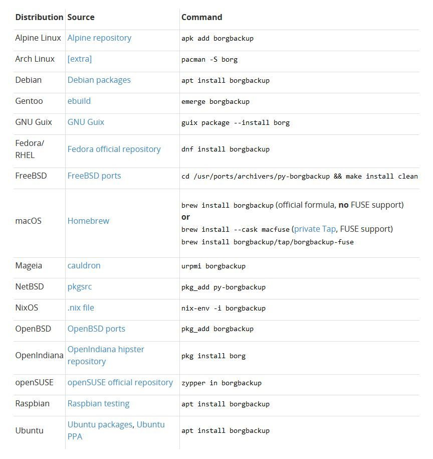
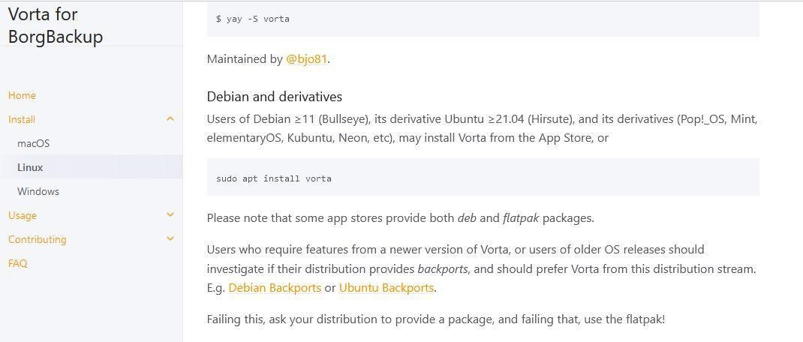

# Linux Backup

## Borg Backup 


<https://borgbackup.readthedocs.io/en/latest/installation.html>

```bash
sudo -u 
apt install borgbackup


```
## GUI für Borg: Vorta




```
sudo apt install vorta
```
## Links

https://wiki.ubuntuusers.de/BorgBackup/
https://www.borgbackup.org/
https://borgbackup.readthedocs.io/en/latest/installation.html


https://vorta.borgbase.com/
https://linuxnews.de/borg-backup-mit-vorta/
https://linux-bibel.atexit/index.php/2024/01/20/vorta-komfortable-gui-fuer-borgbackup/
