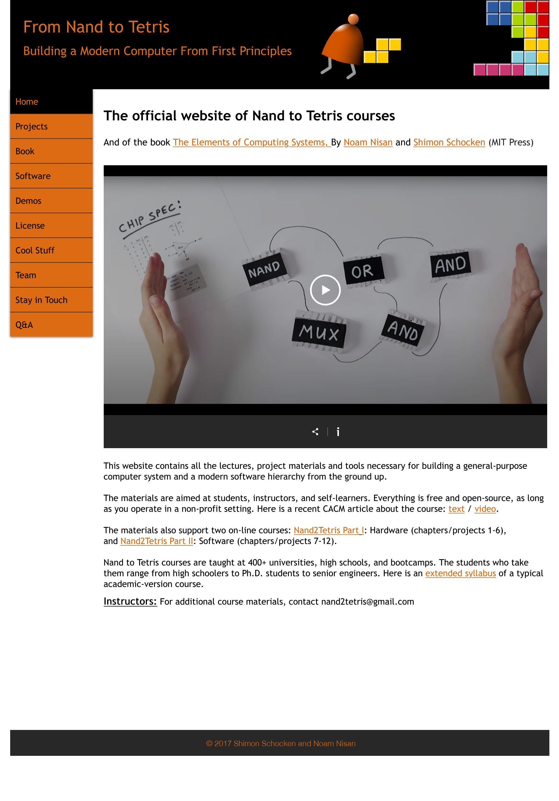

# nand2tetris
https://www.nand2tetris.org/

This website contains all the lectures, project materials and tools necessary for building a general-purpose computer system and a modern software hierarchy from the ground up.

The materials are aimed at students, instructors, and self-learners. Everything is free and open-source, as long as you operate in a non-profit setting. Here is a recent CACM article about the course: text / video.
 

The materials also support two on-line courses: Nand2Tetris Part I: Hardware (chapters/projects 1-6), and Nand2Tetris Part II: Software (chapters/projects 7-12).

​

Nand to Tetris courses are taught at 400+ universities, high schools, and bootcamps. The students who take them range from high schoolers to Ph.D. students to senior engineers. Here is an extended syllabus of a typical academic-version course.

Instructors: For additional course materials, contact nand2tetris@gmail.com
## petzold
https://www.charlespetzold.com/code/

