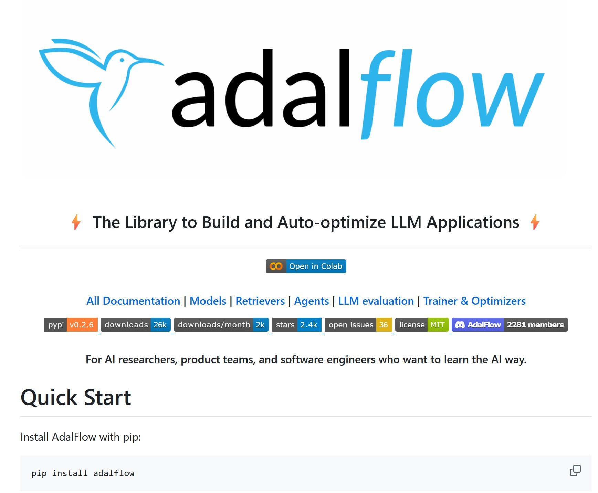

# LightRAG

The Lightning Library for Large Language Model Applications ⚡
LightRAG helps developers with both building and optimizing Retriever-Agent-Generator pipelines. It is light, modular, and robust, with a 100% readable codebase.

<https://github.com/SylphAI-Inc/LightRAG>
