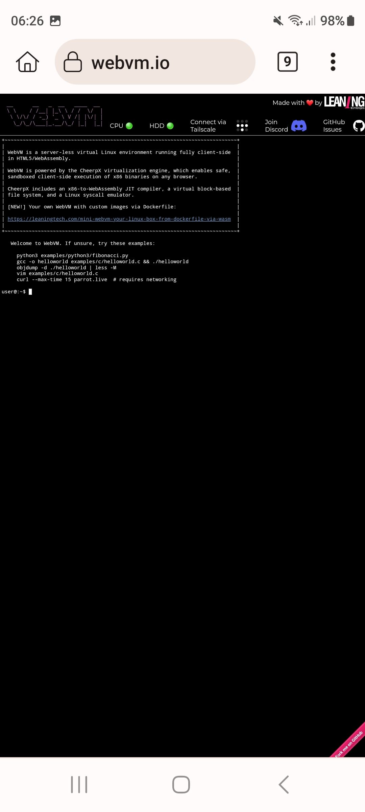
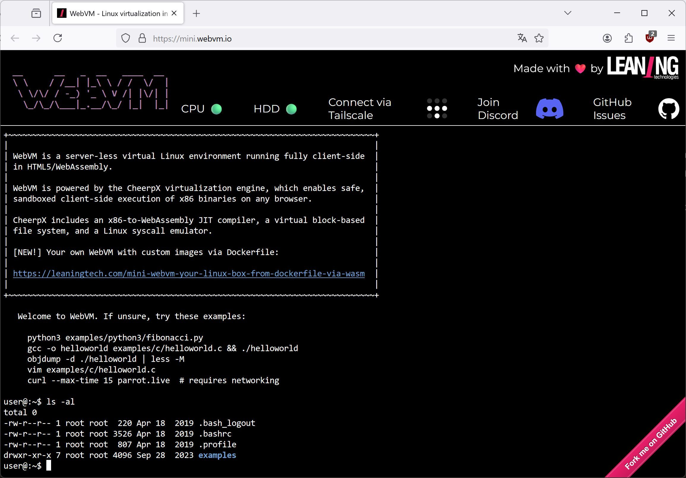
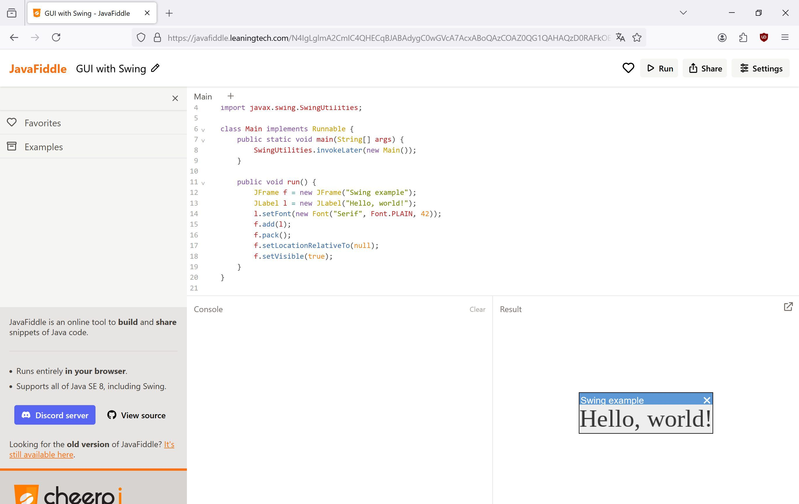

# WebVM - Serverless - Linux - VM - x86 - Sandbox - x86-to-wasm-JIT-compier  

https://github.com/leaningtech/webvm
This repository hosts the source code for https://webvm.io, a Linux virtual machine that runs in your browser.

# Mini.WebVM: Your own Linux box from Dockerfile, virtualized in the browser via WebAssembly

WebVM is a server-less virtual environment running fully client-side in HTML5/WebAssembly. It's designed to be Linux ABI-compatible. It runs an unmodified Debian distribution including many native development toolchains.

WebVM is powered by the CheerpX virtualization engine, and enables safe, sandboxed client-side execution of x86 binaries on any browser. CheerpX includes an x86-to-WebAssembly JIT compiler, a virtual block-based file system, and a Linux syscall emulator.

## on Mobile Browser 

## on Desktop

## Java Web VM mit Swing 

## Links

<https://github.com/leaningtech/javafiddle>

<https://webvm.io/>

<https://mini.webvm.io/>

<https://github.com/leaningtech/webvm/>

