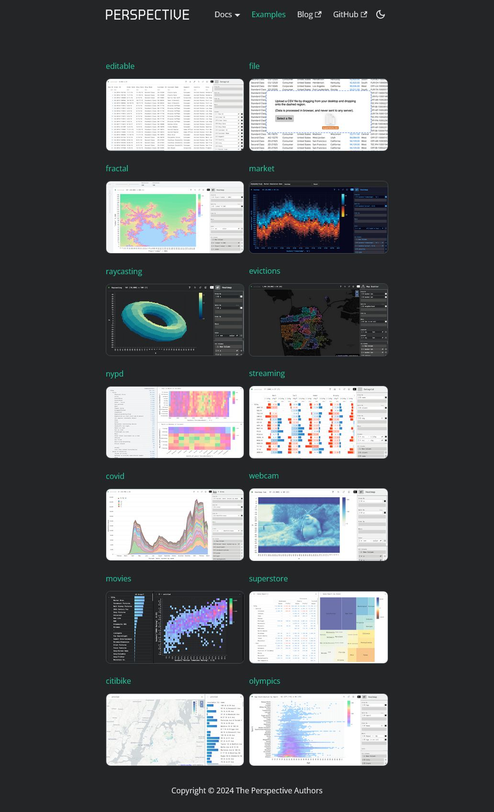

# Perspective

https://github.com/finos/perspective

Perspective is an interactive analytics and data visualization component, which is especially well-suited for large and/or streaming datasets. Use it to create user-configurable reports, dashboards, notebooks and applications, then deploy stand-alone in the browser, or in concert with Python and/or Jupyterlab.
# Voilà

https://github.com/voila-dashboards/voila
Voilà turns Jupyter notebooks into standalone web applications.

Unlike the usual HTML-converted notebooks, each user connecting to the Voilà tornado application gets a dedicated Jupyter kernel which can execute the callbacks to changes in Jupyter interactive widgets.

By default, Voilà disallows execute requests from the front-end, preventing execution of arbitrary code.
By default, Voilà runs with the strip_sources option, which strips out the input cells from the rendered notebook