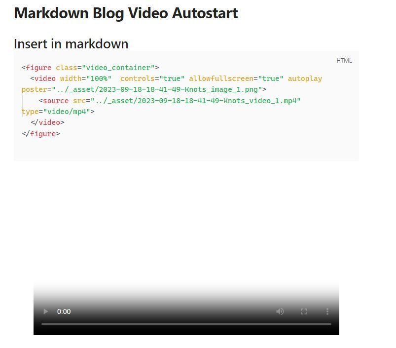

# Markdown Blog Video Autostart

## Insert in Markdown 

```html
<figure class="video_container">
  <video id="myVideo" width="100%"  controls="true" allowfullscreen="true" autoplay poster="../_asset/2023-09-18-Knots_image_1.jpg">
    <source src="../_asset/2023-09-18-Knots_video_1.mp4" type="video/mp4">
  </video>
</figure>

```

<figure class="video_container">
  <video id="myVideo" width="100%"  controls="true" allowfullscreen="true" autoplay poster="../_asset/2023-09-18-Knots_image_1.jpg">
    <source src="../_asset/2023-09-18-Knots_video_1.mp4" type="video/mp4">
  </video>
</figure>





## Start Video at second 3

Add Script 

``` html
<figure class="video_container">
  <video id="myVideo" width="100%"  controls="true" allowfullscreen="true" autoplay poster="../_asset/2023-09-18-Knots_image_1.jpg">
    <source src="../_asset/2023-09-18-Knots_video_1.mp4" type="video/mp4">
  </video>
</figure>

<script> document.addEventListener('DOMContentLoaded', (event) => { var video = document.getElementById('myVideo'); video.currentTime = 3; video.play(); }); </script>

```