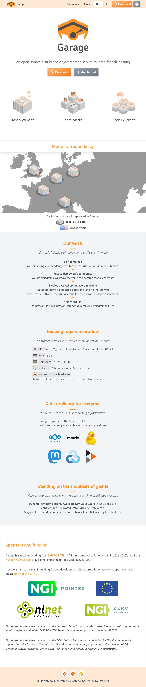

# An open-source distributed object storage service tailored for self-hosting

## Data resiliency for everyone

We built Garage to suit your existing infrastructure:

Garage implements the Amazon S3 API  
and thus is already compatible with many applications.

## Our Goals

We made it lightweight and kept the efficiency in mind:

- Self-contained
    
    We ship a single dependency-free binary that runs on all Linux distributions
    

- Fast to deploy, safe to operate
    
    We are sysadmins, we know the value of operator-friendly software
    

- Deploy everywhere on every machine
    
    We do not have a dedicated backbone, and neither do you,  
    so we made software that run over the Internet across multiple datacent
## Links 

https://garagehq.deuxfleurs.fr/

