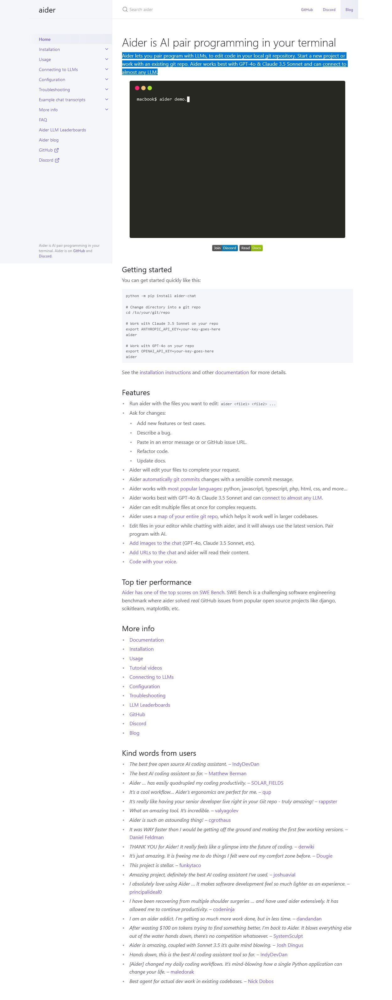

# Aider is AI pair programming in your terminal

Aider lets you pair program with LLMs, to edit code in your local git repository. Start a new project or work with an existing git repo. Aider works best with GPT-4o & Claude 3.5 Sonnet and can [connect to almost any LLM](https://aider.chat/docs/llms.html).

## Links

<https://aider.chat/>

<https://github.com/paul-gauthier/aider>

